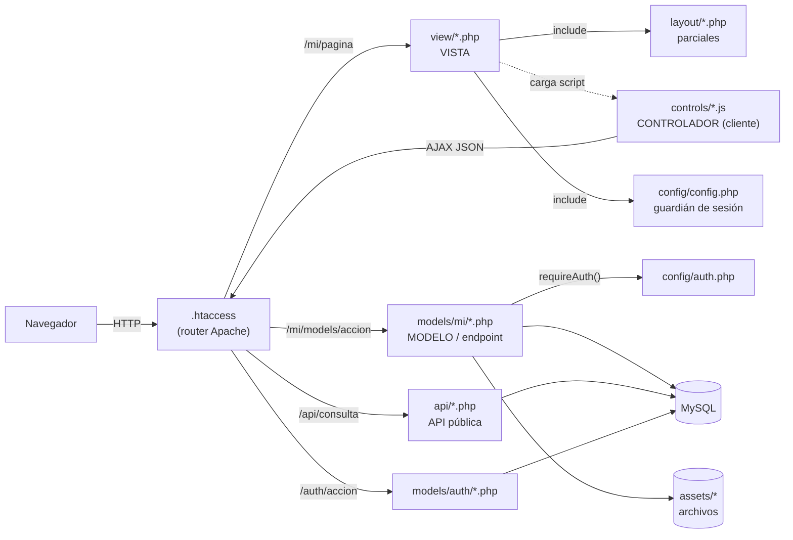
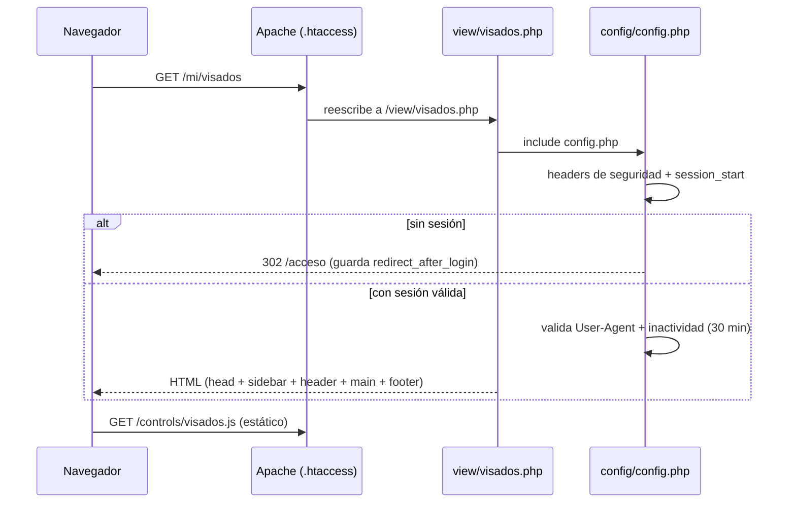
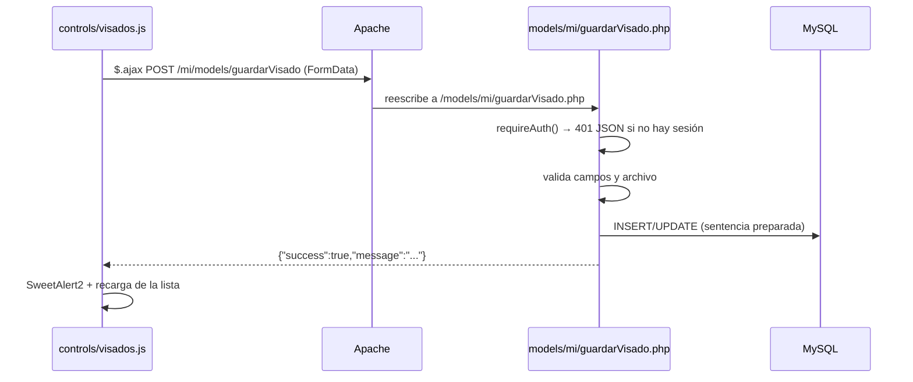
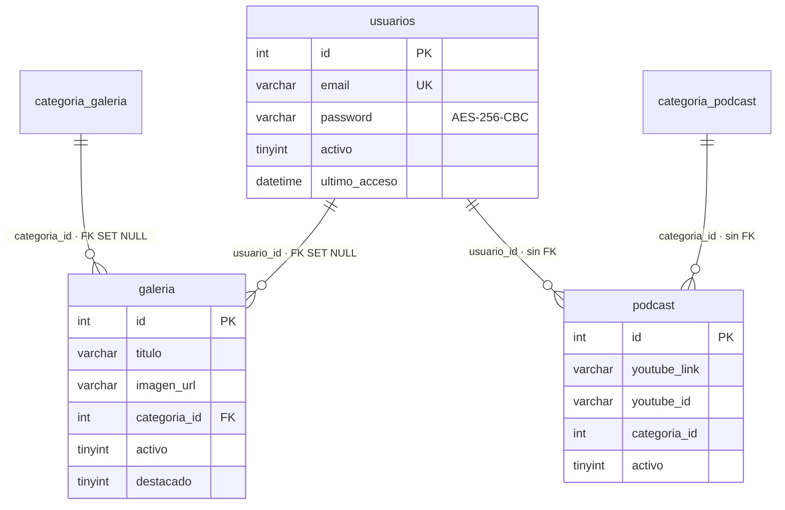

# Sistema Dashboard

Panel administrativo (CMS ligero) en **PHP + MySQL + jQuery/Tailwind** con arquitectura **MVC por capas de carpetas**, autenticación por sesión y una **API pública JSON de solo lectura** para alimentar sitios web externos.

Diseñado para desarrolladores: cada carpeta tiene una sola responsabilidad y añadir un módulo nuevo es un proceso mecánico y repetible (ver [§14](#14-guía-crear-un-módulo-nuevo)).

> Documentación generada a partir del código en el commit `efa25fb` (rama `master`). Todo lo descrito aquí fue verificado contra el repositorio; lo que es una **recomendación** o **propuesta** está marcado como tal.

---

## ⚠️ Lee esto antes de desplegar o publicar

El repositorio **contiene secretos versionados** en su historial de Git. Si el repo es público, asume que están comprometidos:

| Archivo | Secreto expuesto |
|---|---|
| `config/conex.php` | Usuario y contraseña de MySQL |
| `config/openssl_decrypt_pass_cs.php` | Clave AES (`$clave_secreta`) con la que se cifran las contraseñas de usuario y los IDs de la API |
| `mail/contacto.php` | Credenciales SMTP en texto plano |
| `config/sistema_dashboard.sql` | Dump con un usuario cuyo password está cifrado con la clave anterior (por tanto **descifrable**) |

**Acciones necesarias, en este orden:**

1. **Rotar** la contraseña de MySQL, la contraseña SMTP, la clave AES y la contraseña de todos los usuarios del panel.
2. **Mover los secretos fuera del repositorio** (variables de entorno o archivos fuera del *document root*, ver [§7](#7-permisos-de-directorios) y [§17](#17-hoja-de-ruta-hacia-mvc-estricto-y-escalabilidad)).
3. **Purgar el historial** con [`git filter-repo`](https://github.com/newren/git-filter-repo) o BFG y hacer *force-push*. Borrar el archivo en un commit nuevo **no** elimina el secreto del historial.
4. Sacar `config/sistema_dashboard.sql` del repositorio (o sustituirlo por un dump sin datos ni usuarios).

Lista completa de hallazgos en [§16](#16-auditoría-y-deuda-técnica-verificada).

---

## Tabla de contenido

**Nivel 1 — Fundamentos**
1. [Visión general y stack](#1-visión-general-y-stack)
2. [Mapa del repositorio](#2-mapa-del-repositorio)
3. [Instalación en 10 minutos](#3-instalación-en-10-minutos)

**Nivel 2 — Arquitectura y núcleo**
4. [Arquitectura MVC por capas](#4-arquitectura-mvc-por-capas)
5. [Enrutamiento (`.htaccess`)](#5-enrutamiento-htaccess)
6. [Autenticación, sesiones y cabeceras de seguridad](#6-autenticación-sesiones-y-cabeceras-de-seguridad)
7. [Permisos de directorios](#7-permisos-de-directorios)

**Nivel 3 — Datos y contratos**
8. [Base de datos](#8-base-de-datos)
9. [Endpoints internos `/mi/models/*`](#9-endpoints-internos-mimodels)
10. [API pública `/api/*`](#10-api-pública-api)
11. [Formulario de contacto (`mail/`)](#11-formulario-de-contacto-mail)

**Nivel 4 — Frontend y módulos**
12. [Frontend: layout, vistas y controladores JS](#12-frontend-layout-vistas-y-controladores-js)
13. [Módulos funcionales](#13-módulos-funcionales)

**Nivel 5 — Avanzado**
14. [Guía: crear un módulo nuevo](#14-guía-crear-un-módulo-nuevo)
15. [Convenciones del código](#15-convenciones-del-código)
16. [Auditoría y deuda técnica verificada](#16-auditoría-y-deuda-técnica-verificada)
17. [Hoja de ruta hacia MVC estricto y escalabilidad](#17-hoja-de-ruta-hacia-mvc-estricto-y-escalabilidad)
18. [Despliegue](#18-despliegue)
19. [Checklist del primer día](#19-checklist-del-primer-día)

---

# Nivel 1 — Fundamentos

## 1. Visión general y stack

Los administradores inician sesión en el panel (`/acceso`), gestionan contenido (visados, testimonios, resoluciones, galería, podcast, usuarios) y un sitio público lo consume mediante endpoints JSON en `/api/*`.

| Capa | Tecnología | Notas |
|---|---|---|
| Servidor web | **Apache 2.4** con `mod_rewrite`, `mod_headers` | El enrutamiento vive en `.htaccess`. `AllowOverride All` es obligatorio |
| Backend | **PHP ≥ 7.3** (recomendado 8.x) | Usa `setcookie()` con array de opciones y tipos nulables. Extensiones: `mysqli`, `openssl`, `json`, `fileinfo` |
| Base de datos | **MySQL 8 / MariaDB** (`utf8mb4`) | Acceso con `mysqli` y sentencias preparadas. El dump fue generado en MySQL 8.0 / PHP 8.4 |
| Correo | **PHPMailer 7.1** (Composer) | Solo lo usa `mail/contacto.php` |
| Frontend | **jQuery 3.7.1**, **Tailwind (CDN)**, **Font Awesome 6.5.1**, **ApexCharts**, **SweetAlert2 11** | Todo por CDN; no hay *build step* ni `node_modules` |
| Dependencias PHP | `composer.json` → `phpmailer/phpmailer ^7.1` | `vendor/` está versionado (84 archivos) |

**Zona horaria:** `America/Bogota` (definida en `config/config.php` y `models/auth/acceso.php`).

**Lo que NO tiene** (importante para dimensionar el proyecto): tests, CI/CD, Docker, gestor de migraciones, front controller, ORM, roles/permisos por usuario, ni protección CSRF. Ver [§16](#16-auditoría-y-deuda-técnica-verificada) y [§17](#17-hoja-de-ruta-hacia-mvc-estricto-y-escalabilidad).

---

## 2. Mapa del repositorio

Ordenado **de lo más elemental (raíz) a lo más específico**. ≈ 235 archivos; el repo pesa ≈ 54 MiB, casi todo en `assets/` (imágenes subidas).

```text
sistema_dashboard/
├── .htaccess                 # ★ ROUTER: reglas de reescritura, bloqueo de archivos sensibles, headers
├── .gitignore                # Ignora .env, .user.ini, .well-known, .DS_Store
├── composer.json / .lock     # Única dependencia: phpmailer/phpmailer ^7.1
├── README.md                 # Este archivo
│
├── config/                   # ⚙️  NÚCLEO: sesión, auth, BD, cifrado, esquema
│   ├── config.php            #   Guardián de VISTAS: headers de seguridad + sesión + redirecciones
│   ├── session.php           #   Inicia la sesión PHP (cookie: httponly, samesite=Lax)
│   ├── auth.php              #   requireAuth() e isLoggedIn() para endpoints AJAX
│   ├── conex.php             #   Conexión mysqli global ($conex)   ⚠ contiene credenciales
│   ├── encriptar.php         #   encriptar_datos()  → AES-256-CBC + IV aleatorio
│   ├── desencriptar.php      #   desencriptar_datos()
│   ├── openssl_decrypt_pass_cs.php  # $clave_secreta          ⚠ secreto
│   └── sistema_dashboard.sql #   Dump del esquema (+ datos)     ⚠ mover fuera del repo
│
├── layout/                   # 🧩 Parciales de la interfaz (compartidos por todas las vistas)
│   ├── head.php              #   <head>: CDNs (Tailwind, FA, ApexCharts, jQuery, SweetAlert2)
│   ├── header.php            #   Barra superior
│   ├── sidebar.php           #   Menú lateral (array de ítems + lógica de "activo")
│   ├── footer.php            #   Pie de página
│   └── script.php            #   Carga global de controls/all.js
│
├── view/                     # 👁  V — Vistas (páginas PHP con HTML)
│   ├── acceso.php            #   Login (pública)
│   ├── inicio.php            #   Dashboard con estadísticas
│   ├── visados.php · resoluciones.php · testimonios.php · metodo360.php
│   ├── galeria.php · podcast.php · usuarios.php · perfil.php
│   ├── blanco.php            #   ★ PLANTILLA para vistas nuevas
│   └── errores/              #   400 · 401 · 403 · 404 · 500 · 503
│
├── controls/                 # 🎛  C — Controladores del CLIENTE (JS con jQuery)
│   ├── all.js                #   Global: mensaje en consola y bloqueo de atajos de DevTools
│   ├── acceso.js · inicio.js · perfil.js · usuarios.js
│   ├── visados.js · resoluciones.js · testimonios.js · testimoniosMetodo360.js
│   └── galeria.js · podcast.js
│
├── models/                   # 🗄  M — Lógica de datos: un archivo PHP = un endpoint
│   ├── auth/                 #   PÚBLICO:  acceso.php (login) · cerrar.php (logout)
│   └── mi/                   #   PRIVADO (32 archivos, todos con requireAuth()):
│       ├── consultar*.php    #     lectura  (GET)
│       ├── guardar*.php      #     alta / edición (POST)
│       ├── eliminar*.php     #     baja (POST)
│       └── subirImagen · actualizarPerfil · cambiarPassword · obtenerPerfil …
│
├── api/                      # 🌐 API PÚBLICA de solo lectura (8 endpoints, CORS abierto)
│   └── consultar{Galeria,Podcast,Visados,Resoluciones,Instagram,
│                 InstagramMetodo360,CategoriasGaleria,CategoriasPodcast}.php
│
├── mail/
│   └── contacto.php          # Endpoint público POST: formulario de contacto → PHPMailer (SMTP)
│
├── assets/                   # 📦 Archivos SUBIDOS por usuarios (escritura del servidor web)
│   ├── avatares/             #   Fotos de perfil
│   ├── galeria/              #   Imágenes de la galería
│   ├── resoluciones/         #   Imágenes de resoluciones
│   └── visados/              #   Imágenes de visados
│
└── vendor/                   # 📚 Composer: phpmailer 7.1.1 + autoload (versionado)
```

### Convención de nombres (cómo se conectan las piezas)

Una funcionalidad llamada **`X`** se reparte así; el nombre es la "clave" que enlaza las capas:

| Capa | Ubicación | URL |
|---|---|---|
| Vista | `view/X.php` | `/mi/X` |
| Controlador JS | `controls/X.js` | `/controls/X.js` |
| Endpoint privado | `models/mi/{consultar,guardar,eliminar}X.php` | `/mi/models/{consultar,guardar,eliminar}X` |
| Endpoint público | `api/consultarX.php` | `/api/consultarX` |

---

## 3. Instalación en 10 minutos

### 3.1 Requisitos

- Apache 2.4 (`mod_rewrite`, `mod_headers`, `AllowOverride All`)
- PHP ≥ 7.3 con `mysqli`, `openssl`, `json`, `fileinfo`
- MySQL 8 o MariaDB
- Composer (solo si quieres regenerar `vendor/`)

### 3.2 Pasos

```bash
# 1. Clonar dentro del document root (el código asume que el repo ES el docroot)
git clone https://github.com/CentroDigitalGoodmax/sistema_dashboard.git
cd sistema_dashboard

# 2. (Opcional) regenerar dependencias
composer install --no-dev --optimize-autoloader

# 3. Crear la base de datos e importar el esquema
mysql -u root -p -e "CREATE DATABASE sistema_dashboard CHARACTER SET utf8mb4 COLLATE utf8mb4_unicode_ci;"
mysql -u root -p sistema_dashboard < config/sistema_dashboard.sql
```

> **El *document root* de Apache debe ser la raíz del repositorio.** El código construye rutas con `$_SERVER['DOCUMENT_ROOT'] . '/assets/...'` y `.htaccess` reescribe hacia `/config/config.php`, `/view/*.php`, etc.

### 3.3 Configurar credenciales

Hoy los valores están **directamente en archivos PHP** (a corregir, ver [§17](#17-hoja-de-ruta-hacia-mvc-estricto-y-escalabilidad)). Edita, con **tus propios valores nuevos**:

| Archivo | Qué definir |
|---|---|
| `config/conex.php` | `DB_HOST`, `DB_USER`, `DB_PASS`, `DB_NAME` |
| `config/openssl_decrypt_pass_cs.php` | `$clave_secreta` (usa una cadena aleatoria de ≥ 32 caracteres; AES-256 solo utiliza los primeros 32 bytes) |
| `mail/contacto.php` | `SMTP_HOST`, `SMTP_PORT`, `SMTP_USER`, `SMTP_PASS`, `SMTP_FROM`, `SMTP_TO`… |

Generar una clave aleatoria:

```bash
php -r 'echo bin2hex(random_bytes(32)), PHP_EOL;'
```

> ⚠️ Si cambias `$clave_secreta` **después** de haber creado usuarios, sus contraseñas dejan de ser descifrables y nadie podrá iniciar sesión. Cámbiala **antes** de crear usuarios o vuelve a generar las contraseñas.

### 3.4 Crear el primer usuario administrador

Las contraseñas **no se guardan con `password_hash`**: se cifran con AES-256-CBC en formato `base64url(cifrado)::base64url(iv)`. Para generar el valor desde la raíz del repo:

```php
<?php
// generar_password.php  (bórralo después de usarlo)
require __DIR__ . '/config/openssl_decrypt_pass_cs.php';
require __DIR__ . '/config/encriptar.php';   // define $iv
echo encriptar_datos('TuPasswordTemporal', $clave_secreta, $iv), PHP_EOL;
```

```bash
php generar_password.php && rm generar_password.php
```

```sql
INSERT INTO usuarios (nombre, email, password, activo)
VALUES ('Admin', 'admin@tudominio.com', '<valor generado>', 1);
```

> El dump incluye **un usuario de ejemplo**. Elimínalo o cámbiale la contraseña tras importar: su valor cifrado estuvo publicado junto con la clave.

### 3.5 Permisos y primer arranque

Aplica la receta de [§7.3](#73-script-de-permisos-listo-para-usar) y abre `http://tu-host/` → redirige a `/acceso`.

---

# Nivel 2 — Arquitectura y núcleo

## 4. Arquitectura MVC por capas

### 4.1 Diagrama



### 4.2 Responsabilidad de cada capa

| Capa MVC | Carpeta | Responsabilidad | NO debe hacer |
|---|---|---|---|
| **Vista (V)** | `view/`, `layout/` | Renderizar HTML, incluir parciales, aplicar el guardián de sesión (`config.php`) | Consultar la BD directamente |
| **Controlador (C)** | `controls/` | Capturar eventos de UI, validar en cliente, llamar por AJAX a `/mi/models/*`, pintar el resultado | Contener secretos o reglas de negocio |
| **Modelo (M)** | `models/` | Autenticar (`requireAuth`), validar entrada, ejecutar SQL preparado, gestionar archivos, devolver JSON | Generar HTML |
| **Configuración** | `config/` | Sesión, auth, conexión, cifrado, cabeceras | Lógica de un módulo concreto |
| **API pública** | `api/` | Exponer datos activos en solo lectura con CORS abierto | Escribir datos |
| **Almacenamiento** | `assets/` | Servir estáticos subidos | Ejecutar código |

### 4.3 Nota de honestidad arquitectónica

Este proyecto sigue MVC **por convención de carpetas**, no de forma estricta:

- El **Controlador** es JavaScript de cliente (`controls/`); no existe un controlador PHP ni *front controller*.
- Cada archivo de `models/` es un **script-endpoint** que mezcla *controlador + validación + acceso a datos* (no hay clases de modelo ni repositorios).
- El router es **Apache** (`.htaccess`), no una clase PHP.

Esto lo hace simple y muy fácil de leer, pero limita la escalabilidad. La ruta para convertirlo en MVC estricto sin reescribir todo está en [§17](#17-hoja-de-ruta-hacia-mvc-estricto-y-escalabilidad).

### 4.4 Ciclo de vida de una petición

**A) Carga de una página (`GET /mi/visados`)**



**B) Acción de datos (`POST /mi/models/guardarVisado`)**



---

## 5. Enrutamiento (`.htaccess`)

No hay *front controller*: cada URL se mapea a **un archivo PHP** con `RewriteRule`.

| URL pública | Archivo real | Acceso | Descripción |
|---|---|---|---|
| `/` | `config/config.php` | público | Redirige a `/acceso` |
| `/acceso` | `view/acceso.php` | público | Formulario de login |
| `/auth/{nombre}` | `models/auth/{nombre}.php` | público | `acceso` (login, POST), `cerrar` (logout) |
| `/api/{nombre}` | `api/{nombre}.php` | público | API JSON de lectura (solo si el archivo no existe físicamente: `!-f`) |
| `/mi/{pagina}` | `view/{pagina}.php` | **sesión** | Páginas del panel |
| `/mi/models/{accion}` | `models/mi/{accion}.php` | **sesión** | Endpoints AJAX privados |
| cualquier otra | — | — | Si hay sesión → `/mi/inicio`, si no → `/acceso` (lo decide `config.php`) |

**Orden importante:** la regla `^mi/models/([^/]+)$` está **antes** que `^mi/([^/]+)$`; si las inviertes, `/mi/models/x` se interpretaría como una vista.

**Bloqueos que ya implementa `.htaccess`:**

- Listado de directorios desactivado (`Options -Indexes`).
- Archivos/directorios que empiezan por punto (`.git`, `.env`…) → `403`.
- Extensiones sensibles → `403`: `.env .ini .log .sql .sqlite .bak .backup .old .orig .save .swp .tmp .conf .config .dist .example`.
- `composer.json/lock`, `package*.json`, `yarn.lock`, `phpunit.xml`, `Dockerfile`, `docker-compose*`, `.htpasswd` → `403`.
- Páginas de error propias en `view/errores/` (400, 401, 403, 404, 500, 503).

**Lo que NO bloquea** (recomendado añadir, ver [§7.4](#74-endurecer-htaccess)): `/vendor/`, `/config/*.php`, `/layout/*.php`.

---

## 6. Autenticación, sesiones y cabeceras de seguridad

### 6.1 Login — `POST /auth/acceso` → `models/auth/acceso.php`

Campos: `correo`, `pass` (y `remember`, actualmente sin efecto real).

Flujo:

1. Solo `POST`; valida que `correo` sea un email válido.
2. **Bloqueo por intentos**: 5 fallos → bloqueo de 5 minutos (`$_SESSION['login_lock_until']`) y respuesta `429`.
3. `SELECT ... FROM usuarios WHERE email = ?` (sentencia preparada).
4. Rechaza usuarios con `activo != 1` (`403`).
5. Descifra el password almacenado (`desencriptar_datos`) y lo compara con lo enviado.
6. Éxito → `session_regenerate_id(true)`, carga `$_SESSION` (`id`, `nombre`, `email`, `avatar`, `login_time`, `last_activity`, `user_agent`), actualiza `usuarios.ultimo_acceso` y responde `{code:200, redirect, user}`.
   `redirect` viene de `redirect_after_login`, validado por `app_safe_redirect()` (solo rutas que empiecen por `/mi/`, sin `//`, saltos de línea ni `\`).

**Respuestas:** el código HTTP y el campo `code` del JSON **no siempre coinciden** (contraseña incorrecta → HTTP 401 con `code:201`; correo inexistente → HTTP 401 con `code:202`). El controlador `controls/acceso.js` depende de esos valores; no los cambies sin actualizarlo.

### 6.2 Sesión

| Parámetro | Valor |
|---|---|
| Nombre de cookie | `argenmed_session` *(resto de branding original; conviene renombrar)* |
| Duración de cookie | 1800 s (30 min) |
| Flags | `HttpOnly`, `SameSite=Lax`, `Secure` si hay HTTPS (detecta `HTTPS`, `X-Forwarded-Proto` y puerto 443) |
| Inactividad | 30 min (`last_activity`) → destruye sesión y redirige a `/acceso` |
| Anti-robo de cookie | Compara `User-Agent` con el guardado al iniciar sesión |

### 6.3 Dos guardianes distintos

| Guardián | Dónde | Protege | Qué comprueba |
|---|---|---|---|
| `config/config.php` | `include` en cada `view/*.php` | **Vistas** (`/mi/*`) | Sesión, User-Agent, inactividad, redirecciones |
| `requireAuth()` en `config/auth.php` | primera línea de cada `models/mi/*.php` | **Endpoints AJAX** | Solo que exista `$_SESSION['id']` → si no, `401 {"code":401,"message":"No autorizado"}` |

Los 32 endpoints de `models/mi/` llaman a `requireAuth()`. Los de `models/auth/` y `api/` son públicos por diseño.

> Las comprobaciones de **User-Agent e inactividad solo corren en las vistas**, no en `requireAuth()`. Ver [§16](#16-auditoría-y-deuda-técnica-verificada).

### 6.4 Logout

`GET /auth/cerrar` vacía `$_SESSION`, borra la cookie, destruye la sesión y redirige a `/`.

### 6.5 Cifrado (`config/encriptar.php`, `desencriptar.php`)

- Algoritmo: **AES-256-CBC** con `openssl_encrypt`, IV aleatorio (`random_bytes`).
- Formato de salida: `base64url(cifrado)::base64url(iv)`.
- Se usa para (1) el campo `usuarios.password` y (2) **ofuscar el `id`** en las respuestas de `/api/*`.
- Es **cifrado reversible, no *hashing***. Para contraseñas, la práctica estándar es `password_hash()` / `password_verify()` (ver [§17](#17-hoja-de-ruta-hacia-mvc-estricto-y-escalabilidad)).

### 6.6 Cabeceras de seguridad (`config/config.php → app_security_headers()`)

Enviadas por las **vistas**:

| Cabecera | Valor |
|---|---|
| `X-Content-Type-Options` | `nosniff` |
| `X-Frame-Options` | `DENY` |
| `Referrer-Policy` | `strict-origin-when-cross-origin` |
| `Permissions-Policy` | `geolocation=(), microphone=(), camera=()` |
| `Cache-Control` | `no-store, no-cache, must-revalidate, max-age=0` |
| `Strict-Transport-Security` | `max-age=31536000; includeSubDomains` (solo con HTTPS) |
| `Content-Security-Policy` | `default-src 'self'`; scripts de `self` + `cdn.tailwindcss.com`, `cdnjs.cloudflare.com`, `cdn.jsdelivr.net`, `code.jquery.com`; `img-src 'self' data: https:`; `connect-src 'self' https:`; `frame-ancestors 'none'`; `object-src 'none'` |

> **Puntos a tener en cuenta:** la CSP permite `'unsafe-inline'` y `'unsafe-eval'` (necesario por Tailwind CDN). Además, `.htaccess` fija `X-Frame-Options: SAMEORIGIN`, distinto del `DENY` de PHP; verifica el valor efectivo con `curl -I`.

---

## 7. Permisos de directorios

Principio aplicado: **mínimo privilegio**. Solo **`assets/*`** debe ser escribible por el servidor web, y **nunca** debe ejecutar código.

**Actores** (ajusta los nombres a tu entorno):

- `deploy` → usuario que despliega/administra el código.
- `www-data` → usuario de Apache/PHP-FPM (en RHEL/CentOS/Alma suele ser `apache`).

### 7.1 Tabla de permisos recomendados

| Directorio | Propósito | Propietario:Grupo | Dir | Archivos | ¿Escribe el servidor web? | Notas |
|---|---|---|---|---|---|---|
| `/` (raíz) | Código + `.htaccess` | `deploy:www-data` | `755` | `644` | **No** | Apache debe poder leer `.htaccess` |
| `config/` | Sesión, auth, BD, cifrado | `deploy:www-data` | `750` | `640` | **No** | Contiene secretos: sin lectura para «otros». **Ideal:** mover secretos fuera del docroot |
| `mail/` | Endpoint SMTP | `deploy:www-data` | `750` | `640` | **No** | Contiene credenciales SMTP |
| `models/`, `models/auth/`, `models/mi/` | Endpoints PHP | `deploy:www-data` | `755` | `644` | **No** | Solo lectura para PHP |
| `api/` | API pública | `deploy:www-data` | `755` | `644` | **No** | — |
| `view/`, `view/errores/` | Vistas | `deploy:www-data` | `755` | `644` | **No** | — |
| `layout/` | Parciales | `deploy:www-data` | `755` | `644` | **No** | — |
| `controls/` | JS público | `deploy:www-data` | `755` | `644` | **No** | Se sirve como estático |
| `vendor/` | Dependencias Composer | `deploy:www-data` | `755` | `644` | **No** | Bloquear acceso web directo (ver §7.4) |
| `assets/` | Contenedor de subidas | `deploy:www-data` | `755` | — | **No** | Solo agrupa los subdirectorios |
| `assets/avatares/` | Fotos de perfil | `www-data:www-data` | `755` | `644` | **Sí** (crear/borrar) | **Prohibido ejecutar PHP** |
| `assets/galeria/` | Imágenes de galería | `www-data:www-data` | `755` | `644` | **Sí** | **Prohibido ejecutar PHP** |
| `assets/resoluciones/` | Imágenes de resoluciones | `www-data:www-data` | `755` | `644` | **Sí** | **Prohibido ejecutar PHP** |
| `assets/visados/` | Imágenes de visados | `www-data:www-data` | `755` | `644` | **Sí** | **Prohibido ejecutar PHP** |
| `.git/` | Historial | — | — | — | — | **No debe existir en producción** (despliega con `git archive`/CI). `.htaccess` ya bloquea `/.*` |

**Regla de oro:** ningún archivo ni directorio debe ser `777` ni `666`.

> Si añades un módulo con subidas, crea su carpeta dentro de `assets/` con el mismo perfil que `assets/galeria/`. El código ejecuta `mkdir(..., 0755, true)` si la carpeta no existe, y quedará como propiedad del usuario de PHP.

**Hosting compartido** (PHP corre como el usuario de la cuenta, sin `www-data`): usa `755/644` en general y `750/640` (o incluso `700/600`) en `config/` y `mail/`.

### 7.2 Configuración de PHP relacionada

```ini
; php.ini (producción)
display_errors        = Off
log_errors            = On
expose_php            = Off
file_uploads          = On
upload_max_filesize   = 8M     ; el código limita a 5 MB (galería) y 2 MB (avatar)
post_max_size         = 10M
session.use_strict_mode = 1
session.cookie_httponly = 1
date.timezone         = America/Bogota
```

### 7.3 Script de permisos listo para usar

```bash
#!/usr/bin/env bash
set -euo pipefail

APP=/var/www/sistema_dashboard
DEPLOY_USER=deploy
WEB_USER=www-data          # 'apache' en RHEL/CentOS/Alma

# 1) Base: código legible, no escribible por el servidor web
chown -R "$DEPLOY_USER:$WEB_USER" "$APP"
find "$APP" -type d -exec chmod 755 {} \;
find "$APP" -type f -exec chmod 644 {} \;

# 2) Secretos: sin acceso para "otros"
chmod 750 "$APP/config" "$APP/mail"
find "$APP/config" "$APP/mail" -type f -exec chmod 640 {} \;

# 3) Subidas: únicas rutas escribibles por el servidor web
for d in avatares galeria resoluciones visados; do
  mkdir -p "$APP/assets/$d"
  chown -R "$WEB_USER:$WEB_USER" "$APP/assets/$d"
  chmod 755 "$APP/assets/$d"
  find "$APP/assets/$d" -type f -exec chmod 644 {} \;
done

# 4) Verificación: no debe haber nada world-writable
find "$APP" -perm -o+w ! -type l -print
```

Comprobación rápida de que el servidor web **solo** escribe donde debe:

```bash
sudo -u www-data touch /var/www/sistema_dashboard/config/x   # debe FALLAR
sudo -u www-data touch /var/www/sistema_dashboard/assets/galeria/x && \
  rm /var/www/sistema_dashboard/assets/galeria/x             # debe FUNCIONAR
```

### 7.4 Endurecer `.htaccess`

**a) Impedir la ejecución de código en las carpetas de subidas** — crea `assets/.htaccess`:

```apache
# assets/.htaccess — allow-list: solo se sirven imágenes
Options -ExecCGI -Indexes
Require all denied

<FilesMatch "(?i)\.(jpe?g|png|gif|webp)$">
    Require all granted
</FilesMatch>

<IfModule mod_php.c>
    php_flag engine off
</IfModule>
```

**b) Bloquear acceso web directo a código interno** (añadir a `.htaccess` raíz, **antes** de las reglas de rutas). Se usa `THE_REQUEST` para no romper la reescritura interna `^$ → /config/config.php`. Pruébalo primero en *staging*:

```apache
RewriteCond %{THE_REQUEST} \s/(vendor|config|layout)/ [NC]
RewriteRule ^ - [F,L]
```

> Esto no sustituye a la mejor práctica: **mantener `config/` y `vendor/` fuera del *document root***.

---

# Nivel 3 — Datos y contratos

## 8. Base de datos

Motor **InnoDB**, `utf8mb4`. 9 tablas.



| Tabla | Uso | Columnas clave | Estado activo |
|---|---|---|---|
| `usuarios` | Cuentas del panel | `nombre`, `email` (único), `password`, `avatar`, `activo`, `ultimo_acceso` | `activo` |
| `categoria_galeria` | Carpetas de la galería | `nombre`, `slug` (único), `descripcion`, `icono`, `color`, `orden` | `activo` |
| `galeria` | Imágenes | `titulo`, `descripcion`, `imagen_url`, `imagen_thumbnail`, `categoria_id`, `usuario_id`, `visitas`, `likes`, `destacado`, `fecha_publicacion` | `activo` |
| `categoria_podcast` | Categorías de podcast | `nombre`, `slug` (único), `descripcion`, `color`, `orden` | `activo` |
| `podcast` | Videos/episodios de YouTube | `titulo`, `youtube_link`, `youtube_id`, `categoria_id`, `usuario_id`, `thumbnail_url`, `duracion`, `destacado` | `activo` |
| `instagram` | Reels de testimonios | `reel` (ID del reel), `titulo` | `estado` |
| `metodo360` | Reels del «Método 360» | `reel`, `titulo` | `estado` |
| `resoluciones` | Imágenes de resoluciones | `persona`, `img` | `estado` |
| `visados` | Imágenes de visados | `persona`, `img` | `estado` |

**Integridad referencial:** solo `galeria` declara claves foráneas (`galeria_ibfk_1` → `categoria_galeria`, `galeria_ibfk_2` → `usuarios`, ambas `ON DELETE SET NULL`). `podcast` tiene índices sobre `categoria_id`/`usuario_id` pero **sin** `FOREIGN KEY`.

**Inconsistencias conocidas (para no tropezar):**

- Estado activo/inactivo: `activo` (`tinyint`) en unas tablas y `estado` (`int`) en otras. `1` = activo en ambos casos.
- Collations mezcladas: `utf8mb4_unicode_ci` (`usuarios`, `galeria`, `podcast`, categorías) vs `utf8mb4_general_ci` (`instagram`, `metodo360`, `resoluciones`, `visados`). Puede producir errores en `JOIN`s entre ambos grupos.
- Las rutas de imagen se guardan como **URL relativa** (`/assets/galeria/img_xxx.jpg`); la API las completa con el host.
- No hay sistema de migraciones: el esquema vive en `config/sistema_dashboard.sql`.

---

## 9. Endpoints internos `/mi/models/*`

- **Base:** `POST|GET /mi/models/{nombre}` → `models/mi/{nombre}.php`
- **Autenticación:** todos requieren sesión (`requireAuth()`), si no → `401`.
- **Respuesta:** siempre JSON. Los `consultar*` devuelven un **array** de filas; los `guardar*`/`eliminar*` devuelven `{"success": bool, "message": "..."}` (a veces con `id`, `url` o `imagen_url`).
- **Subidas:** `multipart/form-data` (`FormData` desde jQuery).

| Módulo | Consultar (GET) | Guardar (POST) | Eliminar (POST) |
|---|---|---|---|
| Visados | `consultarvisados` ⚠ *(minúscula: nombre real del archivo)* | `guardarVisado` (`id`, `persona`, `estado`, `imagen`, `imagen_actual`) | `eliminarVisado` |
| Resoluciones | `consultarResoluciones` | `guardarResolucion` | `eliminarResolucion` |
| Testimonios (Instagram) | `consultarInstagram` | `guardarInstagram` | `eliminarInstagram` |
| Método 360 | `consultarInstagramMetodo360` | `guardarInstagramMetodo360` | `eliminarInstagramMetodo360` |
| Galería (imágenes) | `consultarGaleria` | `subirImagen` (`titulo`, `descripcion`, `categoria_id`, `imagen` ≤ 5 MB) | `eliminarImagen` |
| Galería (categorías) | `consultarCategoriasGaleria` | `guardarCategoria` | `eliminarCategoria` |
| Podcast (videos) | `consultarPodcast`, `consultarPodcastPorId` | `guardarPodcast` | `eliminarPodcast` |
| Podcast (categorías) | `consultarCategoriasPodcast` | `guardarCategoriaPodcast` | `eliminarCategoriaPodcast` |
| Usuarios | `consultarUsuarios` | `guardarUsuario` (avatar ≤ 2 MB), `cambiarPasswordUsuario` | `eliminarUsuario` (no permite auto-eliminarse) |
| Perfil (usuario logueado) | `obtenerPerfil` | `actualizarPerfil`, `cambiarPassword` | — |

Total: **32 endpoints**. Los guardados usan patrón *upsert*: si llega `id > 0` → `UPDATE`, si no → `INSERT`. Al reemplazar una imagen, el archivo anterior se elimina del disco.

Endpoints públicos de autenticación: `POST /auth/acceso` y `GET /auth/cerrar` (ver [§6](#6-autenticación-sesiones-y-cabeceras-de-seguridad)).

---

## 10. API pública `/api/*`

- **Solo lectura**, método `GET` (+ `OPTIONS` para *preflight*).
- **Sin autenticación**, con `Access-Control-Allow-Origin: *`.
- Devuelven **solo registros activos**.
- El campo `id` se devuelve **cifrado** (`encriptar_datos`), no como entero.
- Las URLs de imagen relativas se convierten a absolutas con el host de la petición.

| Endpoint | Tabla | Contenido |
|---|---|---|
| `GET /api/consultarGaleria` | `galeria` | Imágenes activas, ordenadas por `destacado`, `fecha_publicacion`, `id` (desc.) |
| `GET /api/consultarCategoriasGaleria` | `categoria_galeria` | Categorías de galería |
| `GET /api/consultarPodcast` | `podcast` | Videos activos |
| `GET /api/consultarCategoriasPodcast` | `categoria_podcast` | Categorías de podcast |
| `GET /api/consultarVisados` | `visados` | Visados activos |
| `GET /api/consultarResoluciones` | `resoluciones` | Resoluciones activas |
| `GET /api/consultarInstagram` | `instagram` | Reels de testimonios |
| `GET /api/consultarInstagramMetodo360` | `metodo360` | Reels del Método 360 |

Ejemplo:

```bash
curl -s https://tu-dominio.com/api/consultarGaleria | head
```

```json
[
  {
    "id": "eyJ...::abc...",
    "titulo": "…",
    "imagen_url": "https://tu-dominio.com/assets/galeria/img_xxx.jpg",
    "categoria_id": 13,
    "activo": 1,
    "destacado": 0
  }
]
```

---

## 11. Formulario de contacto (`mail/`)

`POST /mail/contacto.php` (acceso directo por archivo; no tiene regla en `.htaccess`).

| Campo (JSON o form) | Requerido | Validación |
|---|---|---|
| `name` | ✔ | no vacío |
| `email` | ✔ | `FILTER_VALIDATE_EMAIL` |
| `subject` | ✔ | no vacío |
| `message` | ✔ | no vacío |

- Envía **dos correos** con PHPMailer por SMTP (SSL/465): notificación al equipo y acuse de recibo al remitente. Los datos del usuario se escapan con `htmlspecialchars` antes de insertarse en el HTML.
- CORS abierto (`*`) y sin *rate limit* (ver [§16](#16-auditoría-y-deuda-técnica-verificada)).
- Respuestas: `200 {success:true}`, `400 {success:false, errors:[...]}`, `405` si no es `POST`.

---

# Nivel 4 — Frontend y módulos

## 12. Frontend: layout, vistas y controladores JS

### 12.1 Anatomía de una vista

Toda vista sigue el mismo esqueleto (copia `view/blanco.php`):

```php
<?php include('../config/config.php'); ?>          <!-- 1. guardián de sesión + headers -->
<!doctype html>
<html lang="es">
<?php include('../layout/head.php'); ?>            <!-- 2. <head> con CDNs -->
<body class="bg-gray-100 font-sans antialiased">
<div class="flex h-screen">
    <?php include('../layout/sidebar.php'); ?>     <!-- 3. menú lateral -->
    <div class="flex-1 flex flex-col overflow-hidden">
        <?php include('../layout/header.php'); ?>  <!-- 4. barra superior -->
        <main class="flex-1 overflow-y-auto p-6">
            <!-- 5. CONTENIDO del módulo -->
        </main>
        <?php include('../layout/footer.php'); ?>  <!-- 6. pie -->
    </div>
</div>
<script src="/controls/MODULO.js"></script>       <!-- 7. controlador del módulo -->
<?php include('../layout/script.php'); ?>          <!-- 8. controls/all.js (global) -->
</body>
</html>
```

### 12.2 Layout compartido

| Archivo | Función |
|---|---|
| `layout/head.php` | Metadatos, título y librerías CDN (Tailwind, Font Awesome, ApexCharts, jQuery con SRI, SweetAlert2) y estilos base |
| `layout/sidebar.php` | Menú lateral. Los ítems son un **array PHP** (`url`, `icon`, `label`, `active_exact`); añadir un módulo = añadir una línea |
| `layout/header.php` | Barra superior |
| `layout/footer.php` | Pie de página |
| `layout/script.php` | Inyecta `controls/all.js` en todas las vistas |

### 12.3 Patrón de los controladores JS

Cada `controls/X.js` sigue el mismo ciclo, todo con jQuery:

```js
let datos = [];

function cargar() {                        // 1. LEER
  $.ajax({ url: '/mi/models/consultarX', type: 'GET', dataType: 'json',
           success: r => { datos = r; render(r); estadisticas(r); } });
}

function render(lista) { /* 2. PINTAR tarjetas/tabla en el DOM */ }

$('#formX').on('submit', function (e) {    // 3. GUARDAR (alta/edición)
  e.preventDefault();
  $.ajax({ url: '/mi/models/guardarX', type: 'POST', data: new FormData(this),
           processData: false, contentType: false, dataType: 'json',
           success: r => r.success ? (Swal.fire('Listo', r.message, 'success'), cargar())
                                   : Swal.fire('Error', r.message, 'error') });
});

function eliminar(id) { /* 4. SweetAlert de confirmación → POST eliminarX */ }

$(cargar);                                 // 5. ARRANQUE
```

Los controladores incluyen una función de escape de HTML para pintar datos del usuario; **úsala siempre** al concatenar strings dentro de `.html(...)`.

### 12.4 `controls/all.js`

Script global: imprime una advertencia en consola y bloquea atajos (F12, Ctrl+Shift+I/J/C, Ctrl+U, Ctrl+S). **Es solo disuasorio de UX, no una medida de seguridad**: cualquier usuario puede saltárselo. La seguridad real está en el servidor.

---

## 13. Módulos funcionales

| Módulo | Ruta | Vista | Controlador JS | Tabla | Carpeta de archivos |
|---|---|---|---|---|---|
| Inicio (dashboard) | `/mi/inicio` | `inicio.php` | `inicio.js` | `galeria`, `podcast` y sus categorías (vía `consultarGaleria`, `consultarPodcast`, `consultarCategoriasGaleria`, `consultarCategoriasPodcast`) | — |
| Visados | `/mi/visados` | `visados.php` | `visados.js` | `visados` | `assets/visados/` |
| Testimonios | `/mi/testimonios` | `testimonios.php` | `testimonios.js` | `instagram` | — (reels por ID) |
| Método 360 | `/mi/metodo360` | `metodo360.php` | `testimoniosMetodo360.js` | `metodo360` | — (reels por ID) |
| Resoluciones | `/mi/resoluciones` | `resoluciones.php` | `resoluciones.js` | `resoluciones` | `assets/resoluciones/` |
| Galería | `/mi/galeria` | `galeria.php` | `galeria.js` | `galeria`, `categoria_galeria` | `assets/galeria/` |
| Podcast | `/mi/podcast` | `podcast.php` | `podcast.js` | `podcast`, `categoria_podcast` | — (YouTube) |
| Usuarios | `/mi/usuarios` | `usuarios.php` | `usuarios.js` | `usuarios` | `assets/avatares/` |
| Perfil | `/mi/perfil` | `perfil.php` | `perfil.js` | `usuarios` | `assets/avatares/` |
| Acceso (login) | `/acceso` | `acceso.php` | `acceso.js` | `usuarios` | — |

El menú lateral expone: Inicio, Visados, Testimonios, Método 360, Resoluciones, Galería, Podcast y Usuarios.

---

# Nivel 5 — Avanzado

## 14. Guía: crear un módulo nuevo

Ejemplo: módulo **`clientes`**. Es un proceso de 7 pasos siempre igual.

**1. Tabla** (nueva sección en `config/sistema_dashboard.sql` o migración):

```sql
CREATE TABLE clientes (
  id INT NOT NULL AUTO_INCREMENT PRIMARY KEY,
  nombre VARCHAR(150) NOT NULL,
  foto VARCHAR(255) DEFAULT NULL,
  estado TINYINT(1) NOT NULL DEFAULT 1,
  created_at TIMESTAMP NOT NULL DEFAULT CURRENT_TIMESTAMP,
  updated_at TIMESTAMP NOT NULL DEFAULT CURRENT_TIMESTAMP ON UPDATE CURRENT_TIMESTAMP
) ENGINE=InnoDB DEFAULT CHARSET=utf8mb4 COLLATE=utf8mb4_unicode_ci;
```

**2. Endpoints** en `models/mi/` (`consultarClientes.php`, `guardarClientes.php`, `eliminarClientes.php`). Plantilla base (patrón real del proyecto):

```php
<?php
require_once __DIR__ . '/../../config/conex.php';
require_once __DIR__ . '/../../config/auth.php';

$idUsuario = requireAuth();            // 401 JSON si no hay sesión
header('Content-Type: application/json');

try {
    $id     = isset($_POST['id']) && $_POST['id'] !== '' ? intval($_POST['id']) : 0;
    $nombre = trim($_POST['nombre'] ?? '');
    $estado = intval($_POST['estado'] ?? 1);

    if ($nombre === '') {
        echo json_encode(['success' => false, 'message' => 'El nombre es requerido']);
        exit;
    }

    if ($id > 0) {
        $stmt = mysqli_prepare($conex, 'UPDATE clientes SET nombre = ?, estado = ? WHERE id = ?');
        mysqli_stmt_bind_param($stmt, 'sii', $nombre, $estado, $id);
    } else {
        $stmt = mysqli_prepare($conex, 'INSERT INTO clientes (nombre, estado) VALUES (?, ?)');
        mysqli_stmt_bind_param($stmt, 'si', $nombre, $estado);
    }

    $ok = mysqli_stmt_execute($stmt);
    mysqli_stmt_close($stmt);

    echo json_encode(['success' => $ok, 'message' => $ok ? 'Guardado' : 'No se pudo guardar']);
} catch (Throwable $e) {
    error_log($e->getMessage());       // ← registrar en servidor, no devolver al cliente
    http_response_code(500);
    echo json_encode(['success' => false, 'message' => 'Error interno']);
}
```

**3. Vista:** copia `view/blanco.php` → `view/clientes.php`, añade el HTML del módulo y `<script src="/controls/clientes.js"></script>`.

**4. Controlador:** crea `controls/clientes.js` siguiendo el patrón de [§12.3](#123-patrón-de-los-controladores-js).

**5. Menú:** añade el ítem en el array de `layout/sidebar.php`:

```php
['url' => '/mi/clientes', 'icon' => 'fas fa-address-book', 'label' => 'Clientes'],
```

**6. (Opcional) API pública:** copia `api/consultarVisados.php` → `api/consultarClientes.php` y ajusta tabla/columnas. Mantén `WHERE estado = 1`.

**7. (Si hay subidas):** crea `assets/clientes/` con el perfil de permisos de [§7.1](#71-tabla-de-permisos-recomendados), incluye el `.htaccess` de [§7.4](#74-endurecer-htaccess) y valida el archivo así:

```php
$finfo = new finfo(FILEINFO_MIME_TYPE);
$mime  = $finfo->file($_FILES['imagen']['tmp_name']);           // MIME real, no el del cliente
$ext   = ['image/jpeg'=>'jpg','image/png'=>'png','image/webp'=>'webp','image/gif'=>'gif'][$mime] ?? null;
if (!$ext) { /* rechazar */ }
$filename = bin2hex(random_bytes(8)) . '.' . $ext;              // extensión decidida por el servidor
```

**Checklist de un módulo listo:** ☐ `requireAuth()` en cada endpoint ☐ SQL solo con sentencias preparadas ☐ errores a `error_log`, no al cliente ☐ subidas validadas por MIME real ☐ entrada al DOM escapada ☐ ítem en sidebar ☐ permisos de carpeta aplicados.

---

## 15. Convenciones del código

- **Idioma:** identificadores y textos en español (`consultar`, `guardar`, `eliminar`).
- **Nombres de archivo:** `verboEntidad.php` en camelCase (`guardarVisado.php`). Ojo con la excepción `consultarvisados.php` (minúscula): el sistema de archivos de Linux distingue mayúsculas.
- **SQL:** solo `mysqli` con `prepare/bind_param`. No concatenar variables en consultas.
- **Respuestas JSON:** los `guardar/eliminar` usan `{success, message}`; el login usa `{code, message}`. Para módulos nuevos, unifica en `{success, message, data}`.
- **Archivos subidos:** nombre único (`uniqid('img_')`, `res_`, `avatar_`), ruta relativa en BD, borrado del archivo anterior al reemplazar.
- **Soft-disable:** se desactiva con `activo`/`estado = 0` en lugar de borrar en la API pública.
- **Fechas:** zona `America/Bogota`; columnas `created_at`/`updated_at` automáticas.
- **Frontend:** jQuery + Tailwind por clases utilitarias; confirmaciones y avisos con SweetAlert2.

---

## 16. Auditoría y deuda técnica verificada

Estado real del código en `efa25fb`. **Lo ya resuelto** respecto a versiones anteriores: los 32 endpoints de `models/mi/` exigen sesión, el SQL usa sentencias preparadas (no se encontraron consultas con variables concatenadas), hay redirección segura, regeneración de sesión, bloqueo de intentos, cabeceras CSP/HSTS y `.htaccess` con bloqueos de archivos sensibles.

### 🔴 Críticos

| # | Hallazgo | Detalle y mitigación |
|---|---|---|
| 1 | **Secretos en el repositorio** | BD, clave AES, SMTP y dump con usuario. Rotar, sacar del repo y purgar historial (ver aviso inicial) |
| 2 | **Subidas validadas solo por datos del cliente** | `guardarVisado`, `guardarResolucion`, `guardarUsuario`, `actualizarPerfil` y `subirImagen` comprueban `$_FILES[...]['type']` (lo declara el cliente) y toman la extensión del nombre original. Un usuario autenticado podría subir `x.php` declarándolo `image/png`. **Mitigar:** `finfo` + extensión decidida por el servidor (§14, paso 7) y `assets/.htaccess` que impida ejecución (§7.4) |
| 3 | **Contraseñas con cifrado reversible** | Cualquiera con la clave AES obtiene todas las contraseñas. Migrar a `password_hash(PASSWORD_ARGON2ID/BCRYPT)` + `password_verify()`, y re-hash en el siguiente login |

### 🟠 Altos

| # | Hallazgo | Detalle y mitigación |
|---|---|---|
| 4 | **Sin protección CSRF** | Ningún formulario ni endpoint usa token. `SameSite=Lax` mitiga parte, pero `GET /auth/cerrar` (logout) es vulnerable a *logout CSRF*. Añadir token por sesión validado en cada `POST` |
| 5 | **Sin roles/permisos** | Cualquier usuario autenticado puede crear, editar y borrar usuarios y cambiar contraseñas ajenas (`guardarUsuario`, `eliminarUsuario`, `cambiarPasswordUsuario`). Añadir columna/tabla de roles y verificarla en el servidor |
| 6 | **Formulario de contacto abierto** | CORS `*`, sin límite de tasa ni CAPTCHA → puede usarse para enviar correo masivo con tu SMTP. Restringir origen, añadir *rate limit* y CAPTCHA |
| 7 | **Enumeración de usuarios** | El login distingue «El correo no está registrado» de «Contraseña incorrecta». Usar un mensaje único |
| 8 | **Bloqueo de intentos ligado a la sesión** | Se elude descartando la cookie. Guardar intentos por IP/usuario en BD o caché |

### 🟡 Medios / calidad

| # | Hallazgo | Detalle |
|---|---|---|
| 9 | Guardián de vistas ≠ guardián de endpoints | User-Agent e inactividad solo se verifican en `config.php` (vistas); `requireAuth()` solo comprueba `$_SESSION['id']` |
| 10 | Errores internos expuestos | Varios endpoints devuelven `mysqli_stmt_error()` / `$e->getMessage()`; la API pública devuelve `mysqli_error()`. Registrar con `error_log` y responder mensaje genérico |
| 11 | `error_reporting(0)` en `config.php` | Oculta errores también en desarrollo. Controlar por entorno |
| 12 | Código duplicado | `app_is_https()` / `app_safe_redirect()` repetidos en `config.php` y `acceso.php`; bloque de sesión repetido en `config.php` y `session.php` |
| 13 | Cabeceras contradictorias | `X-Frame-Options`: `DENY` (PHP) vs `SAMEORIGIN` (`.htaccess`) |
| 14 | CSP permisiva | `'unsafe-inline'` y `'unsafe-eval'` por Tailwind CDN. Compilar Tailwind en build para endurecerla |
| 15 | `vendor/` y subidas versionados | ≈ 54 MiB de repo. Ignorar `vendor/` y `assets/*/*` (dejar `.gitkeep`) |
| 16 | `vendor/` accesible por web | Incluye scripts como `get_oauth_token.php`. Bloquear (§7.4) o mover fuera del docroot |
| 17 | Sin tests ni CI | Añadir PHPUnit y un *pipeline* (lint + análisis estático) |
| 18 | Sin migraciones | El esquema vive en un dump; usar Phinx/Flyway o SQL versionado |
| 19 | Sin `LICENSE` | Definir licencia antes de publicarlo a la comunidad |
| 20 | Restos de branding | Cookie `argenmed_session` y textos «Argen Medical» en `layout/head.php`, `layout/footer.php` y `mail/contacto.php`. Parametrizar |

---

## 17. Hoja de ruta hacia MVC estricto y escalabilidad

> **Propuesta** (no implementada). Está ordenada para que cada paso sea independiente y no rompa lo existente.

**Fase 0 — Higiene (1–2 días)**
Rotar secretos, purgar historial, `assets/.htaccess`, `.gitignore` de `vendor/` y subidas, `LICENSE`.

**Fase 1 — Configuración por entorno**
Sustituir las constantes y archivos con secretos por variables de entorno con [`vlucas/phpdotenv`](https://github.com/vlucas/phpdotenv); un solo `config/app.php` que lea `.env` (ya ignorado por `.gitignore`) fuera del docroot.

**Fase 2 — Front controller y router**
Un `public/index.php` como único punto de entrada; el *document root* pasa a `public/` y `config/`, `models/`, `vendor/` quedan **fuera** de la web. Sustituir las reglas de `.htaccess` por un router PHP (p. ej. FastRoute o `symfony/routing`). La tabla de [§5](#5-enrutamiento-htaccess) se convierte en un archivo `routes.php`.

**Fase 3 — Capas PHP reales (PSR-4)**

```text
app/
├── Controllers/     # reciben Request, orquestan, devuelven Response  (C real)
├── Models/          # entidades / repositorios: solo acceso a datos    (M real)
├── Services/        # reglas de negocio (subidas, cifrado, correo)
├── Middleware/      # Auth, CSRF, Roles, RateLimit
└── Views/           # plantillas (Twig o PHP puro)                     (V real)
public/  routes/  config/  database/migrations/  storage/uploads/  tests/
```

Migración incremental: mover cada `models/mi/guardarX.php` a `Controllers/XController@guardar` + `Models/XRepository`, manteniendo la misma URL.

**Fase 4 — Seguridad estructural**
`password_hash`, middleware CSRF, RBAC (`roles`, `permisos`), *rate limit* en BD/Redis, subidas en `storage/` servidas por controlador.

**Fase 5 — Calidad y operación**
PHPUnit + PHPStan, GitHub Actions, migraciones, Docker Compose, logs estructurados (Monolog).

**Fase 6 — Escalado horizontal**
Sesiones en Redis/BD (para varios servidores), archivos subidos en almacenamiento de objetos (S3 compatible), caché de la API pública (ETag / caché HTTP / CDN).

---

## 18. Despliegue

Ejemplo de *virtual host* Apache (HTTPS):

```apache
<VirtualHost *:443>
    ServerName panel.tu-dominio.com
    DocumentRoot /var/www/sistema_dashboard

    <Directory /var/www/sistema_dashboard>
        AllowOverride All
        Require all granted
    </Directory>

    SSLEngine on
    SSLCertificateFile    /etc/letsencrypt/live/panel.tu-dominio.com/fullchain.pem
    SSLCertificateKeyFile /etc/letsencrypt/live/panel.tu-dominio.com/privkey.pem

    ErrorLog  ${APACHE_LOG_DIR}/sistema_dashboard_error.log
    CustomLog ${APACHE_LOG_DIR}/sistema_dashboard_access.log combined
</VirtualHost>
```

```bash
sudo a2enmod rewrite headers ssl
sudo systemctl reload apache2
```

**Consideraciones:**

- **Nginx no es compatible sin adaptación:** las reglas de `.htaccess` deberían portarse a `location`/`try_files`.
- **Backups:** base de datos (`mysqldump`) **y** `assets/*` (≈ 79 MB hoy; las imágenes no están en la BD, solo su ruta).
- **Detrás de proxy/CDN:** el código ya reconoce `X-Forwarded-Proto` para marcar la cookie como `Secure`.
- **Actualizar dependencias:** `composer update phpmailer/phpmailer` y revisar avisos de seguridad.
- **Despliegue sin `.git`:** `git archive --format=tar HEAD | tar -x -C /var/www/sistema_dashboard`.

---

## 19. Checklist del primer día

- [ ] Clonar el repo y leer [§4](#4-arquitectura-mvc-por-capas) y [§5](#5-enrutamiento-htaccess)
- [ ] Rotar secretos y confirmar que ninguno queda en el historial
- [ ] Crear BD, importar esquema y configurar credenciales propias ([§3](#3-instalación-en-10-minutos))
- [ ] Crear tu usuario administrador y eliminar el del dump
- [ ] Aplicar el script de permisos ([§7.3](#73-script-de-permisos-listo-para-usar)) y añadir `assets/.htaccess`
- [ ] Abrir `/acceso`, iniciar sesión y recorrer cada módulo del menú
- [ ] Llamar a `/api/consultarGaleria` y verificar el JSON
- [ ] Crear un módulo de prueba siguiendo [§14](#14-guía-crear-un-módulo-nuevo)
- [ ] Revisar [§16](#16-auditoría-y-deuda-técnica-verificada) y elegir los tres primeros ítems a corregir

---

## Contribuir

1. Crea una rama desde `master` (`feature/nombre` o `fix/nombre`).
2. Sigue las [convenciones](#15-convenciones-del-código) y el checklist de módulo de [§14](#14-guía-crear-un-módulo-nuevo).
3. **Nunca** incluyas credenciales, dumps con datos reales ni archivos subidos en un commit.
4. Abre un *pull request* describiendo el cambio y cómo probarlo.

## Licencia

*Pendiente de definir.* El repositorio aún no incluye un archivo `LICENSE`; añade uno (por ejemplo MIT o Apache-2.0) antes de publicarlo como proyecto comunitario.