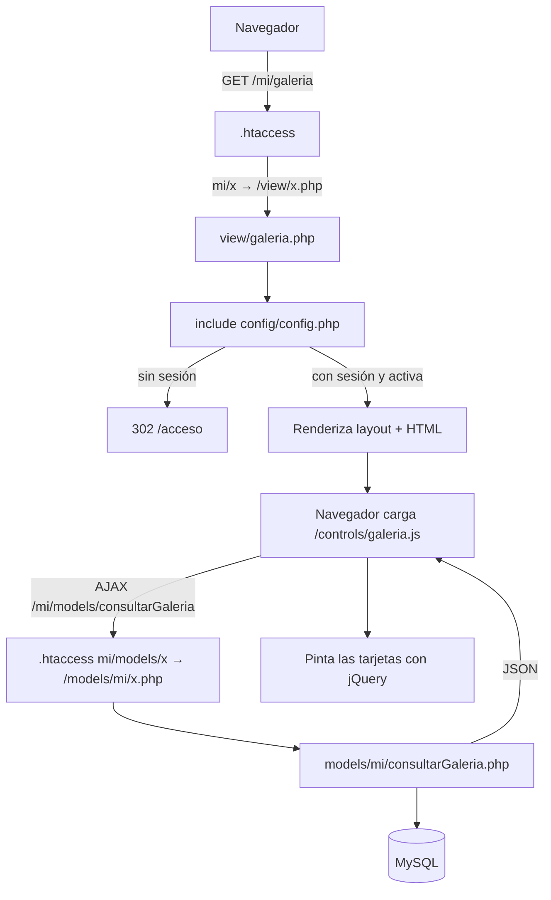

# Argen Medical — Panel de Control de Contenido (Dashboard)

Panel administrativo (CMS ligero) que alimenta el sitio público de **Argen Medical**. Los administradores inician sesión, gestionan contenido (visados, testimonios, resoluciones, galería, podcast/videos, usuarios) y el sitio público consume ese contenido a través de una **API JSON pública de solo lectura**. Además incluye un endpoint de correo para el formulario de contacto del sitio.

> **Lee primero la sección [15. Hallazgos de seguridad y deuda técnica](#15-hallazgos-de-seguridad-y-deuda-técnica).** Hay problemas críticos (endpoints sin autenticación, subida de archivos sin validar extensión y secretos versionados) que conviene resolver antes de seguir agregando funcionalidades.

---

## Tabla de contenido

1. [Resumen y stack](#1-resumen-y-stack)
2. [Estructura del proyecto](#2-estructura-del-proyecto)
3. [Puesta en marcha local](#3-puesta-en-marcha-local)
4. [Arquitectura y ciclo de una petición](#4-arquitectura-y-ciclo-de-una-petición)
5. [Enrutamiento (`.htaccess`)](#5-enrutamiento-htaccess)
6. [Autenticación y sesiones](#6-autenticación-y-sesiones)
7. [Cabeceras de seguridad y CSP](#7-cabeceras-de-seguridad-y-csp)
8. [Base de datos (esquema inferido)](#8-base-de-datos-esquema-inferido)
9. [Endpoints internos `/mi/models/*`](#9-endpoints-internos-mimodels)
10. [API pública `/api/*`](#10-api-pública-api)
11. [Correo de contacto](#11-correo-de-contacto)
12. [Frontend: layout, vistas y controladores JS](#12-frontend-layout-vistas-y-controladores-js)
13. [Módulos funcionales, uno por uno](#13-módulos-funcionales-uno-por-uno)
14. [Guía: cómo agregar un módulo nuevo](#14-guía-cómo-agregar-un-módulo-nuevo)
15. [Hallazgos de seguridad y deuda técnica](#15-hallazgos-de-seguridad-y-deuda-técnica)
16. [Convenciones del código](#16-convenciones-del-código)
17. [Despliegue](#17-despliegue)
18. [Checklist del primer día](#18-checklist-del-primer-día)

---

## 1. Resumen y stack

| Capa | Tecnología |
|---|---|
| Backend | **PHP procedural** (sin framework, sin MVC formal). Requiere `mysqli` con `mysqlnd` (usa `get_result()`), `openssl`. Mínimo realista: **PHP 7.3+** (usa `session_set_cookie_params([...])` con array); recomendado 8.x |
| Base de datos | **MySQL / MariaDB**, charset `utf8mb4`, acceso con `mysqli` |
| Servidor web | **Apache** con `mod_rewrite` y `AllowOverride All` (todo el ruteo vive en `.htaccess`) |
| Frontend | HTML renderizado por PHP + **jQuery 3.7.1** + **Tailwind CSS vía CDN** (Play CDN, sin build) + Font Awesome 6.5.1 + SweetAlert2 + ApexCharts (cargado, sin uso visible) |
| Correo | **PHPMailer 7.1.1** (Composer, `vendor/` está versionado) por SMTP SSL (465) |
| Cifrado | AES-256-CBC con `openssl_encrypt` (contraseñas de usuarios e IDs expuestos en la API) |
| Zona horaria | `America/Bogota` (definida en `config/config.php` y `models/auth/acceso.php`) |
| Idioma | UI y comentarios en español |

No hay: gestor de paquetes JS, bundler, tests automatizados, migraciones, `.env`, ni control de versiones configurado (`.gitignore`) dentro del zip.

### Cómo se relaciona con el sitio público

```
 Sitio público (React, según comentarios)          Panel (este proyecto)
 ┌────────────────────────────┐   GET /api/*       ┌──────────────────────────┐
 │ Galería, Podcast, Reels,   │ ─────────────────▶ │ api/*.php  (solo lectura)│
 │ Visados, Resoluciones      │                    │                          │
 │ Formulario de contacto     │ ─ POST ──────────▶ │ mail/contacto.php        │
 └────────────────────────────┘                    │                          │
                                                   │ Admin ── /acceso ──▶ /mi/*│
                                                   └────────────┬─────────────┘
                                                                ▼
                                                     MySQL  +  /assets/* (imágenes)
```

---

## 2. Estructura del proyecto

```
.
├── .htaccess                  # Ruteo, bloqueo de archivos sensibles, cabeceras, páginas de error
├── composer.json / .lock      # Solo requiere phpmailer/phpmailer ^7.1
├── vendor/                    # Dependencias Composer (versionadas). No editar.
│
├── config/
│   ├── config.php             # "Guardián" de vistas: cabeceras, sesión, timeout, redirecciones
│   ├── conex.php              # Conexión mysqli → variable global $conex
│   ├── openssl_decrypt_pass_cs.php  # Define $clave_secreta (clave AES). SECRETO
│   ├── encriptar.php          # encriptar_datos($datos, $clave, $iv) + genera $iv aleatorio
│   └── desencriptar.php       # desencriptar_datos($datos, $clave)
│
├── layout/                    # Fragmentos reutilizables (los incluyen todas las vistas)
│   ├── head.php               # <head>: CDNs (Tailwind, FA, jQuery, SweetAlert2, ApexCharts) + CSS base
│   ├── sidebar.php            # Menú lateral responsive (array $menu_items) + JS del sidebar
│   ├── header.php             # Barra superior "Bienvenido, {nombre}"
│   ├── footer.php             # Pie de página
│   └── script.php             # Carga /controls/all.js (global a todas las vistas)
│
├── view/                      # Páginas HTML+PHP (una por módulo)
│   ├── acceso.php             # Login (pública)
│   ├── inicio.php             # Dashboard con contadores y últimos registros
│   ├── perfil.php             # Perfil del usuario y cambio de contraseña
│   ├── usuarios.php           # CRUD de usuarios del panel
│   ├── visados.php            # CRUD de visados (imagen + persona)
│   ├── testimonios.php        # CRUD de reels de Instagram (testimonios)
│   ├── metodo360.php          # CRUD de reels de Instagram — "Método Ruta 360°"
│   ├── resoluciones.php       # CRUD de resoluciones (imagen + persona)
│   ├── galeria.php            # Categorías + imágenes de galería
│   ├── podcast.php            # Categorías + posts/videos de YouTube
│   ├── blanco.php             # PLANTILLA vacía para crear vistas nuevas
│   └── errores/               # 400, 401, 403, 404, 500, 503 (ErrorDocument de Apache)
│
├── controls/                  # JavaScript por página (jQuery + AJAX)
│   ├── all.js                 # Global: bloqueo de DevTools/consola (¡ver §12.4!)
│   ├── acceso.js              # Login AJAX, toggle de contraseña, cookie "recordarme"
│   ├── inicio.js · perfil.js · usuarios.js · visados.js · resoluciones.js
│   ├── testimonios.js · testimoniosMetodo360.js · galeria.js · podcast.js
│
├── models/                    # Endpoints que ejecutan lógica/SQL y responden JSON
│   ├── auth/                  #   /auth/*        (públicos)
│   │   ├── acceso.php         #   login
│   │   └── cerrar.php         #   logout
│   └── mi/                    #   /mi/models/*   (los que usa el panel; 31 archivos)
│
├── api/                       # API PÚBLICA (CORS *, solo GET) para el sitio web
├── mail/contacto.php          # Endpoint del formulario de contacto (PHPMailer)
└── assets/                    # Archivos subidos (NO son código)
    ├── galeria/               #   img_<uniqid>.<ext>
    ├── resoluciones/          #   res_<uniqid>.<ext>
    └── visados/               #   res_<uniqid>.<ext>   (mismo prefijo "res_" que resoluciones)
```

> **Nota Linux:** los nombres de archivo distinguen mayúsculas. El modelo de visados es `consultarvisados.php` (con "v" minúscula) y el JS lo llama exactamente así. Respétalo.

---

## 3. Puesta en marcha local

### 3.1 Requisitos

- Apache 2.4 con `mod_rewrite` y `mod_headers`, `AllowOverride All`.
- PHP 7.3+ (mejor 8.x) con extensiones `mysqli` (mysqlnd) y `openssl`.
- MySQL 5.7+/MariaDB 10.3+.
- **El proyecto debe servirse desde la raíz del dominio** (p. ej. `http://localhost/`), no desde un subdirectorio: el `.htaccess` reescribe a rutas absolutas (`/view/...`, `/models/...`) y los modelos usan `$_SERVER['DOCUMENT_ROOT']` para guardar/borrar archivos. El servidor embebido de PHP (`php -S`) **no** sirve porque ignora `.htaccess`.

### 3.2 Opción rápida con Docker

```yaml
# docker-compose.yml (ejemplo, no incluido en el repo)
services:
  web:
    image: php:8.2-apache
    ports: ["8080:80"]
    volumes: [".:/var/www/html"]
    command: >
      bash -c "docker-php-ext-install mysqli &&
               a2enmod rewrite headers &&
               sed -i 's/AllowOverride None/AllowOverride All/g' /etc/apache2/apache2.conf &&
               apache2-foreground"
    depends_on: [db]
  db:
    image: mariadb:10.6
    environment:
      MARIADB_DATABASE: sistema_dashboard
      MARIADB_USER: sistema_dashboard
      MARIADB_PASSWORD: dev_password
      MARIADB_ROOT_PASSWORD: root
```

> Con Docker, el host de la BD es `db` (no `localhost`): ajusta `DB_HOST` en `config/conex.php` **solo en tu copia local**.

### 3.3 Configuración

1. **Base de datos:** crea la BD y las tablas (ver [§8](#8-base-de-datos-esquema-inferido); el repo **no** trae un `.sql`).
2. **Credenciales:** edita `config/conex.php` (`DB_HOST`, `DB_USER`, `DB_PASS`, `DB_NAME`). ⚠️ Ese archivo contiene credenciales reales y un bloque comentado con las de otro host; ver [§15](#15-hallazgos-de-seguridad-y-deuda-técnica). **No las copies a tickets, chats ni commits.**
3. **Clave AES:** `config/openssl_decrypt_pass_cs.php` define `$clave_secreta`. En local puedes usar una propia, pero entonces las contraseñas existentes en una BD de producción **no** se podrán descifrar. Usa la misma clave que la BD con la que trabajes.
4. **Permisos de escritura** sobre `assets/galeria`, `assets/resoluciones` y `assets/visados` (el servidor las crea con `0755` si no existen; el usuario de Apache debe poder escribir).
5. **Correo (opcional):** `mail/contacto.php` tiene el SMTP incrustado. En local no lo ejecutes sin cambiar el destinatario (`SMTP_TO`) o enviarás correos reales.

### 3.4 Crear el primer usuario administrador

No hay usuario semilla y las contraseñas están **cifradas (reversible)**, no hasheadas, así que no sirve un `INSERT` con texto plano. Genera el valor cifrado desde la raíz del proyecto:

```php
<?php
// gen_pass.php  (bórralo después de usarlo)
require __DIR__ . '/config/openssl_decrypt_pass_cs.php';
require __DIR__ . '/config/encriptar.php';
echo encriptar_datos('TuContraseñaSegura', $clave_secreta, $iv), PHP_EOL;
```

```bash
php gen_pass.php   # copia la salida "xxxxx::yyyyy"
```

```sql
INSERT INTO usuarios (nombre, email, password, activo)
VALUES ('Admin', 'admin@ejemplo.com', 'PEGA_AQUI_LA_SALIDA', 1);
```

Después entra a `http://localhost:8080/acceso`.

### 3.5 Depurar en local (importante)

Tres mecanismos del proyecto **ocultan** los errores y **bloquean** las herramientas de desarrollo. Desactívalos temporalmente en tu entorno:

| Mecanismo | Dónde | Efecto | Cómo desactivar en dev |
|---|---|---|---|
| `error_reporting(0)` | `config/config.php` línea 2 | Oculta todos los errores/warnings PHP de las vistas | Cambiar a `error_reporting(E_ALL)` (sin commitearlo) |
| Silencio de consola | `controls/all.js` | Anula `console.log/error/warn/...` y suprime `window.onerror` | Comentar `<script src="/controls/all.js">` en `layout/script.php` |
| Detector de DevTools | `controls/all.js` | Si `outerWidth-innerWidth > 160` **reemplaza todo el `<body>`** por un mensaje. Con DevTools acoplado al costado/abajo se dispara | Igual: no cargar `all.js` |

Además `config.php` envía `Cache-Control: no-store`, por lo que el navegador no cachea las vistas.

---

## 4. Arquitectura y ciclo de una petición

No hay front controller: **Apache reescribe la URL directamente al archivo PHP** correspondiente.



**Patrón de cada módulo (siempre igual):**

1. `view/<modulo>.php` → incluye `config.php` (guardián), `layout/*` y define el HTML + modales vacíos.
2. `controls/<modulo>.js` → al cargar (`$(document).ready`) hace AJAX a `/mi/models/consultar*`, guarda el resultado en una variable global (`xData`) y pinta con plantillas de texto (template literals).
3. Crear/editar → `POST /mi/models/guardar*` (si `id > 0` hace `UPDATE`, si no `INSERT`).
4. Eliminar → `POST /mi/models/eliminar*` con `id`.
5. Feedback al usuario con **SweetAlert2** y recarga de la lista.

**Cuatro "familias" de respuestas JSON** (no hay un contrato único, ten cuidado al consumirlas):

| Familia | Forma | Usada por |
|---|---|---|
| Mutaciones | `{"success": bool, "message": "...", "id"?: n, "imagen_url"?: "..."}` | `guardar*`, `eliminar*`, `subirImagen`, `actualizarPerfil`, `cambiarPassword` |
| Consultas del panel | Array crudo `[{...}, ...]` o `{"error": "..."}` | `models/mi/consultar*` |
| Login | `{"code": 200\|201\|202\|400\|403\|429\|500, "message": "..."}` | `models/auth/acceso.php` |
| API pública | Array crudo **o** `{"data": [...]}` **o** `{"total": n, "data": [...]}` según el endpoint | `api/*` |

---

## 5. Enrutamiento (`.htaccess`)

Reglas (en orden de aparición):

| URL pública | Se reescribe a | Requiere sesión | Descripción |
|---|---|---|---|
| `/` | `config/config.php` | — | `config.php` redirige a `/acceso` (o a `/mi/inicio` si hay sesión) |
| `/acceso` | `view/acceso.php` | No (redirige a inicio si ya hay sesión) | Pantalla de login |
| `/auth/{nombre}` | `models/auth/{nombre}.php` | No | `acceso` (login), `cerrar` (logout) |
| `/api/{nombre}` | `api/{nombre}.php` (solo si no existe ya como archivo) | No | API pública |
| `/mi/models/{nombre}` | `models/mi/{nombre}.php` | **Ver §15 (casi ninguno la exige realmente)** | Endpoints AJAX del panel |
| `/mi/{nombre}` | `view/{nombre}.php` | Sí (vía `config.php`) | Vistas del panel |

Seguridad y errores definidos en el mismo archivo:

- `Options -Indexes` (sin listado de directorios) y bloqueo de cualquier ruta que empiece con `.`.
- Bloquea (403) por nombre/extensión: `.env .ini .log .sql .sqlite .bak .backup .old .orig .save .swp .tmp .conf .config .dist .example`, además de `composer.json/lock`, `package*.json`, `yarn.lock`, `Dockerfile`, `docker-compose*`, `.htpasswd`. *(Práctico: un `schema.sql` no será descargable desde la web.)*
- Cabeceras: `X-Content-Type-Options: nosniff`, `X-Frame-Options: SAMEORIGIN`, `Referrer-Policy: strict-origin-when-cross-origin`.
- `ErrorDocument` 400/401/403/404/500/503 → `view/errores/*.php`.

### Mapa completo de URLs

**Vistas (`/mi/*`, requieren sesión):**

| URL | Vista | JS | Aparece en el menú |
|---|---|---|---|
| `/mi/inicio` | `view/inicio.php` | `inicio.js` | Sí |
| `/mi/visados` | `view/visados.php` | `visados.js` | Sí |
| `/mi/testimonios` | `view/testimonios.php` | `testimonios.js` | Sí |
| `/mi/metodo360` | `view/metodo360.php` | `testimoniosMetodo360.js` | Sí |
| `/mi/resoluciones` | `view/resoluciones.php` | `resoluciones.js` | Sí |
| `/mi/galeria` | `view/galeria.php` | `galeria.js` | Sí |
| `/mi/podcast` | `view/podcast.php` | `podcast.js` | Sí |
| `/mi/usuarios` | `view/usuarios.php` | `usuarios.js` | Sí |
| `/mi/perfil` | `view/perfil.php` | `perfil.js` | **No** (no hay enlace en el sidebar) |
| `/mi/blanco` | `view/blanco.php` | — | No (plantilla) |

**Rutas que existen en la UI pero no en el backend:** el enlace `¿Olvidaste tu contraseña?` apunta a `/recuperar-password`, que **no existe** (cae en 404).

---

## 6. Autenticación y sesiones

### 6.1 Login (`POST /auth/acceso` → `models/auth/acceso.php`)

Flujo (`view/acceso.php` + `controls/acceso.js`):

1. El formulario usa `name="email"` / `name="password"`, pero `acceso.js` **envía** `correo`, `pass` y `remember` por AJAX (`$.ajax`, POST, 30 s de timeout).
2. El modelo valida método POST, campos no vacíos, formato de email y bloqueo por intentos.
3. Busca `SELECT id, nombre, email, password, activo, avatar, ultimo_acceso FROM usuarios WHERE email = ?`.
4. Descifra la contraseña almacenada (`desencriptar_datos`) y la compara con `===` contra la ingresada.
5. Éxito: `session_regenerate_id(true)`, guarda en `$_SESSION`: `id, nombre, email, avatar, login_time, last_activity, user_agent, login_attempts=0`; actualiza `usuarios.ultimo_acceso`; responde `redirect: /mi/inicio`.

| `code` | Significado | UI |
|---|---|---|
| 200 | Login correcto | Alerta verde y redirección tras 1,5 s |
| 201 | Contraseña incorrecta | Limpia la contraseña |
| 202 | Correo no registrado | Selecciona el campo email |
| 400 | Método inválido / campos vacíos / email inválido | Mensaje del servidor |
| 403 | Usuario inactivo (`activo != 1`) | Advertencia |
| 429 | Bloqueado temporalmente | Mensaje con minutos restantes |
| 500 | Error interno | Mensaje del servidor |

**"Recordarme":** solo guarda el correo en la cookie `user_email` (30 días, no `HttpOnly`) para **rellenar el campo** en la próxima visita. **No** extiende la sesión.

**Anti fuerza bruta:** 5 intentos fallidos → bloqueo de 5 minutos, pero el contador vive **en la sesión** (`login_attempts`, `login_lock_until`); descartar la cookie lo reinicia (ver §15).

### 6.2 Guardián de vistas (`config/config.php`)

Cada vista lo incluye en su primera línea. En orden:

1. `error_reporting(0)` y zona horaria `America/Bogota`.
2. Envía cabeceras de seguridad y CSP (ver §7).
3. Inicia sesión con **nombre `argenmed_session`**, cookie de 30 min, `httponly`, `samesite=Lax`, `secure` si es HTTPS (detecta `HTTPS`, `X-Forwarded-Proto` o puerto 443).
4. Si hay sesión (`$_SESSION['id']`): invalida si cambió el **User-Agent** o si pasaron **más de 1800 s** de inactividad (`last_activity`); si no, renueva `last_activity`. Al invalidar redirige a `/acceso`.
5. Reglas de redirección según `REQUEST_URI`:
   - `/mi/...` sin sesión → `/acceso`
   - `/acceso...` con sesión → `/mi/inicio`
   - `/` o `/index.php` → `/acceso`
   - cualquier otra ruta → `/mi/inicio` (con sesión) o `/acceso`

> ⚠️ **`config.php` solo protege las vistas.** Los endpoints de `models/` y `api/` **no lo incluyen**, así que la regla "`/mi/...` requiere sesión" **no se aplica** a `/mi/models/*` (ver §15, punto crítico #1).

### 6.3 Logout

`models/auth/cerrar.php` vacía `$_SESSION`, hace `session_destroy()` y redirige a `/`. Dos defectos (ver §15): el enlace del sidebar apunta a `/controls/auth/cerrar` (ruta inexistente; la correcta es `/auth/cerrar`) y `cerrar.php` no llama `session_name('argenmed_session')`, por lo que no destruye la sesión real del panel.

### 6.4 Cifrado de contraseñas e IDs

```php
// Formato almacenado en usuarios.password y en los "id" de la API pública:
//   base64url(AES-256-CBC(dato)) . '::' . base64url(IV)
encriptar_datos($dato, $clave_secreta, $iv)   // config/encriptar.php
desencriptar_datos($cifrado, $clave_secreta)  // config/desencriptar.php
```

- `base64url` = `+ / =` reemplazados por `- _ (nada)`.
- `config/encriptar.php` genera **un IV aleatorio por petición** (`$iv = random_bytes(...)` al incluir el archivo). Consecuencia práctica: el `id` cifrado de un mismo registro **cambia en cada llamada** a la API pública. **No lo uses como clave estable** (`key` de React, caché, favoritos); usa otro campo.
- Es cifrado **reversible**, no hash. La clave está en `config/openssl_decrypt_pass_cs.php` (`$clave_secreta`).
- Ningún endpoint del repo **descifra** los `id` cifrados de la API; sirven solo como identificador opaco de cara al sitio público.

---

## 7. Cabeceras de seguridad y CSP

`config/config.php → app_security_headers()` (solo en respuestas de **vistas**):

- `X-Content-Type-Options: nosniff`, `X-Frame-Options: DENY`, `Referrer-Policy: strict-origin-when-cross-origin`, `Permissions-Policy` (sin geolocalización/micrófono/cámara), `Cache-Control: no-store`, HSTS si es HTTPS.
- **CSP** con `default-src 'self'`; `script-src` permite `'unsafe-inline' 'unsafe-eval'` + `cdn.tailwindcss.com`, `cdnjs.cloudflare.com`, `cdn.jsdelivr.net`, `code.jquery.com`; `style-src` con `cdnjs` y `cdn.tailwindcss`; `img-src 'self' data: https:`; `font-src` con cdnjs/jsdelivr; `connect-src 'self' https:`; `frame-ancestors 'none'`.

**Si agregas una librería desde otro CDN**, debes (a) incluirla en `layout/head.php` y (b) añadir su dominio a la CSP en `config.php`, o el navegador la bloqueará en silencio (recuerda que `all.js` oculta los errores de consola).

**Posible bug activo:** la CSP **no define `frame-src`**, por lo que hereda `default-src 'self'` y el navegador **bloquearía los iframes** que usan los visores de `podcast.js` (`youtube.com/embed/...`) y de `testimonios.js` / `testimoniosMetodo360.js` (`instagram.com/reel/.../embed`). Si esos visores salen en blanco, esta es la causa probable (y `all.js` oculta el error de consola). Solución: añadir a la CSP `frame-src https://www.youtube.com https://www.instagram.com;`. Verifícalo en el entorno real.

---

## 8. Base de datos (esquema inferido)

> El zip **no incluye** el script SQL. Lo siguiente se **dedujo del código** (columnas usadas en `SELECT/INSERT/UPDATE`). Tipos, índices y llaves son **suposiciones razonables**: valida contra la BD real (`SHOW CREATE TABLE ...`) y guarda el volcado en el repo (por ejemplo `database/schema.sql`; los `.sql` están bloqueados por `.htaccess`).

Base: `sistema_dashboard`, charset `utf8mb4`.

```sql
CREATE TABLE usuarios (
  id INT AUTO_INCREMENT PRIMARY KEY,
  nombre VARCHAR(100) NOT NULL,
  email VARCHAR(150) NOT NULL UNIQUE,
  password VARCHAR(255) NOT NULL,            -- "cifrado::iv" (AES-256-CBC, ver §6.4)
  avatar VARCHAR(500) NULL,                  -- URL externa (no hay subida de avatar)
  activo TINYINT(1) NOT NULL DEFAULT 1,
  ultimo_acceso DATETIME NULL,
  created_at TIMESTAMP DEFAULT CURRENT_TIMESTAMP,
  updated_at TIMESTAMP DEFAULT CURRENT_TIMESTAMP ON UPDATE CURRENT_TIMESTAMP
);

CREATE TABLE categoria_galeria (
  id INT AUTO_INCREMENT PRIMARY KEY,
  nombre VARCHAR(100) NOT NULL,
  slug VARCHAR(120), descripcion TEXT,
  icono VARCHAR(60) DEFAULT 'fas fa-folder',
  color VARCHAR(20) DEFAULT '#6366F1',
  orden INT DEFAULT 0, activo TINYINT(1) DEFAULT 1,
  created_at DATETIME
);

CREATE TABLE galeria (
  id INT AUTO_INCREMENT PRIMARY KEY,
  titulo VARCHAR(200) NOT NULL, descripcion TEXT,
  imagen_url VARCHAR(500) NOT NULL,          -- ruta relativa: /assets/galeria/img_xxx.jpg
  imagen_thumbnail VARCHAR(500) NULL,        -- previsto, hoy no se llena
  categoria_id INT, usuario_id INT NULL,
  visitas INT DEFAULT 0, likes INT DEFAULT 0,
  activo TINYINT(1) DEFAULT 1, destacado TINYINT(1) DEFAULT 0,
  fecha_publicacion DATETIME,
  created_at TIMESTAMP DEFAULT CURRENT_TIMESTAMP,
  updated_at TIMESTAMP DEFAULT CURRENT_TIMESTAMP ON UPDATE CURRENT_TIMESTAMP
);

CREATE TABLE categoria_podcast (
  id INT AUTO_INCREMENT PRIMARY KEY,
  nombre VARCHAR(100) NOT NULL, slug VARCHAR(120), descripcion TEXT,
  color VARCHAR(20) DEFAULT '#6366F1',
  orden INT DEFAULT 0, activo TINYINT(1) DEFAULT 1, created_at DATETIME
);

CREATE TABLE podcast (
  id INT AUTO_INCREMENT PRIMARY KEY,
  titulo VARCHAR(200) NOT NULL, descripcion TEXT,
  youtube_link VARCHAR(500) NOT NULL, youtube_id VARCHAR(20),
  thumbnail_url VARCHAR(500),                -- https://img.youtube.com/vi/<id>/maxresdefault.jpg
  categoria_id INT NULL, usuario_id INT NULL,
  duracion VARCHAR(20) NULL,                 -- texto libre, p. ej. "12:30"
  destacado TINYINT(1) DEFAULT 0, activo TINYINT(1) DEFAULT 1,
  visitas INT DEFAULT 0, likes INT DEFAULT 0,
  fecha_publicacion DATE,
  created_at TIMESTAMP DEFAULT CURRENT_TIMESTAMP,
  updated_at TIMESTAMP DEFAULT CURRENT_TIMESTAMP ON UPDATE CURRENT_TIMESTAMP
);

-- Testimonios de Instagram (panel: /mi/testimonios)
CREATE TABLE instagram (
  id INT AUTO_INCREMENT PRIMARY KEY,
  reel VARCHAR(100) NOT NULL,                -- solo el ID del reel (regex ^[A-Za-z0-9_-]+$)
  titulo VARCHAR(200) NOT NULL,
  estado TINYINT(1) DEFAULT 1,
  created_at TIMESTAMP DEFAULT CURRENT_TIMESTAMP,
  updated_at TIMESTAMP DEFAULT CURRENT_TIMESTAMP ON UPDATE CURRENT_TIMESTAMP
);
-- Idéntica estructura para "Método Ruta 360°" (panel: /mi/metodo360)
CREATE TABLE metodo360 LIKE instagram;

CREATE TABLE resoluciones (
  id INT AUTO_INCREMENT PRIMARY KEY,
  persona VARCHAR(150) NOT NULL,
  img VARCHAR(500) NOT NULL,                 -- /assets/resoluciones/res_xxx.png
  estado TINYINT(1) DEFAULT 1,
  created_at TIMESTAMP DEFAULT CURRENT_TIMESTAMP,
  updated_at TIMESTAMP DEFAULT CURRENT_TIMESTAMP ON UPDATE CURRENT_TIMESTAMP
);
CREATE TABLE visados LIKE resoluciones;      -- img apunta a /assets/visados/res_xxx.png
```

**Relaciones (lógicas, sin FK confirmadas):** `galeria.categoria_id → categoria_galeria.id`, `podcast.categoria_id → categoria_podcast.id`, `podcast.usuario_id / galeria.usuario_id → usuarios.id`.

**Semántica de "activo":** las tablas `usuarios`, `galeria`, `podcast` y las categorías usan la columna **`activo`**; `instagram`, `metodo360`, `resoluciones` y `visados` usan **`estado`**. Ambas: `1` = visible/activo. La API pública filtra siempre por `activo = 1` / `estado = 1`.

---

## 9. Endpoints internos `/mi/models/*`

Todos viven en `models/mi/<nombre>.php`, se llaman como `/mi/models/<nombre>` (sin `.php`), responden `application/json` y usan **sentencias preparadas** (excepto las consultas `SELECT *` sin parámetros).

### 9.1 Consultas (GET)

| Endpoint | Tabla | Orden | Notas |
|---|---|---|---|
| `consultarGaleria` | `galeria` | `id DESC` | `SELECT *` |
| `consultarCategoriasGaleria` | `categoria_galeria` | `id DESC` | `SELECT *` |
| `consultarPodcast` | `podcast` | `fecha_publicacion DESC, id DESC` | `SELECT *` |
| `consultarPodcastPorId?id=N` | `podcast` | — | `{"error":"Post no encontrado"}` si no existe. **No lo usa ninguna vista actual** |
| `consultarCategoriasPodcast` | `categoria_podcast` | `id DESC` | |
| `consultarInstagram` | `instagram` | `id DESC` | Testimonios |
| `consultarInstagramMetodo360` | `metodo360` | `id DESC` | |
| `consultarResoluciones` | `resoluciones` | `id DESC` | |
| `consultarvisados` | `visados` | `id DESC` | (minúscula) |
| `consultarUsuarios` | `usuarios` | `id DESC` | ⚠️ `SELECT *` → **incluye la columna `password`** |
| `obtenerPerfil` | `usuarios` | — | Perfil del usuario de sesión (sin `password`). Valida `$_SESSION['id']` |

### 9.2 Escritura (POST)

Los `guardar*` hacen **upsert manual**: `id > 0` ⇒ `UPDATE`; en otro caso `INSERT`.

| Endpoint | Campos POST | Efecto / validaciones |
|---|---|---|
| `guardarUsuario` | `id?`, `nombre*`, `email*`, `password` (obligatoria si es nuevo), `avatar`, `activo` | Cifra la contraseña con AES. Si `id>0` y `password` vacío, no la cambia. Email duplicado solo se verifica al **crear** |
| `eliminarUsuario` | `id*` | Bloquea si solo queda 1 usuario. **No impide que un usuario se elimine a sí mismo** |
| `actualizarPerfil` | `nombre*`, `email*`, `avatar` | Solo sobre el usuario en sesión. Valida email único frente a otros |
| `cambiarPassword` | `password_current*`, `password_new*` | Valida la actual (descifrando) y guarda la nueva cifrada. El front exige ≥ 6 caracteres; el back no |
| `guardarCategoria` | `id?`, `nombre*`, `descripcion`, `icono`, `color`, (`slug`, `orden`, `activo`) | Genera `slug` a partir del nombre si no llega. Ver nota abajo |
| `eliminarCategoria` | `id*` | **Borra también todas las imágenes de esa categoría en BD** (los archivos físicos quedan huérfanos en `assets/galeria`) |
| `subirImagen` | `titulo*`, `descripcion`, `categoria_id*`, `imagen*` (file) | Valida MIME (declarado por el cliente) y máx **5 MB**. Guarda en `/assets/galeria/img_<uniqid>.<ext>` y hace `INSERT` con `NOW()` |
| `eliminarImagen` | `id*` | Borra el archivo físico (`DOCUMENT_ROOT + imagen_url`) y luego la fila |
| `guardarCategoriaPodcast` | `id?`, `nombre*`, `descripcion`, `color`, (`slug`, `orden`, `activo`) | Igual que la de galería, sin `icono` |
| `eliminarCategoriaPodcast` | `id*` | **Borra también todos los posts de esa categoría** |
| `guardarPodcast` | `id?`, `titulo*`, `youtube_link*`, `descripcion`, `categoria_id`, `usuario_id`(def. 1), `duracion`, `destacado`, `activo`, `visitas`, `likes`, `fecha_publicacion` (`YYYY-MM-DD`, def. hoy) | Extrae `youtube_id` de `watch?v=`, `youtu.be/`, `/embed/`, `/shorts/`, `/v/` (11 caracteres) y arma `thumbnail_url = https://img.youtube.com/vi/<id>/maxresdefault.jpg` |
| `eliminarPodcast` | `id*` | Borra la fila |
| `guardarInstagram` / `guardarInstagramMetodo360` | `id?`, `reel*`, `titulo*`, `estado` | `reel` debe cumplir `^[A-Za-z0-9_-]+$`. Devuelve `id` al crear |
| `eliminarInstagram` / `eliminarInstagramMetodo360` | `id*` | Borra la fila |
| `guardarResolucion` | `id?`, `persona*`, `estado`, `imagen` (file, obligatoria al crear), `imagen_actual` | Sube a `/assets/resoluciones/res_<uniqid>.<ext>`. Ver bug en §15 |
| `eliminarResolucion` | `id*` | Borra la fila y luego el archivo |
| `guardarVisado` | Igual que `guardarResolucion` | Sube a `/assets/visados/res_<uniqid>.<ext>` |
| `eliminarVisado` | `id*` | Borra la fila y luego el archivo |

`*` = obligatorio.

**Nota sobre categorías:** el JS de galería solo envía `id, nombre, descripcion, icono, color`. Al **editar**, el modelo recibe `orden` y `activo` ausentes y usa los valores por defecto (`orden = 0`, `activo = 1`) y **regenera el `slug`**, por lo que editar una categoría puede reactivarla o resetear su orden. `podcast.js` envía `id, nombre, descripcion, icono, color` (el `icono` es ignorado por `guardarCategoriaPodcast`, que no tiene esa columna), así que ocurre exactamente lo mismo con las categorías de podcast.

**Códigos HTTP:** los modelos siempre responden `200` (incluso en error); el error va en `success:false` o `error`. Los `catch` devuelven el mensaje de excepción al cliente (fuga de información).

---

## 10. API pública `/api/*`

Solo lectura, para el sitio web. Todas: `Access-Control-Allow-Origin: *`, métodos `GET, OPTIONS` (responden `200` al preflight), `Content-Type: application/json`, `JSON_UNESCAPED_UNICODE | JSON_PRETTY_PRINT`, `500` con `{"error": "..."}` ante fallo de BD. Todas exponen el `id` **cifrado** (ver §6.4) y filtran solo registros activos.

| Endpoint | Filtro | Orden | Forma de respuesta |
|---|---|---|---|
| `GET /api/consultarCategoriasGaleria` | `activo = 1` | `orden ASC, id ASC` | `[ {id, nombre, slug, descripcion, icono, color, orden, activo, created_at} ]` |
| `GET /api/consultarGaleria` | `activo = 1` | `destacado DESC, fecha_publicacion DESC, id DESC` | `[ {id, titulo, descripcion, imagen_url, imagen_thumbnail, categoria_id, usuario_id, visitas, likes, activo, destacado, fecha_publicacion, created_at, updated_at} ]` — `imagen_url` se devuelve **absoluta** (`http(s)://host/...`) |
| `GET /api/consultarCategoriasPodcast` | `activo = 1` | `orden ASC, id ASC` | `[ {id, nombre, slug, descripcion, color, orden, activo, created_at} ]` |
| `GET /api/consultarPodcast` | `activo = 1` + filtros | `destacado DESC, fecha_publicacion DESC, id DESC` | `{ "total": n, "data": [ {... , categoria_nombre, categoria_color, fecha_formateada (d/m/Y)} ] }` |
| `GET /api/consultarInstagram` | `estado = 1` | `id DESC` | `{ "data": [ {id, reel, titulo} ] }` |
| `GET /api/consultarInstagramMetodo360` | `estado = 1` | `id DESC` | `{ "data": [ {id, reel, titulo} ] }` |
| `GET /api/consultarResoluciones` | `estado = 1` | `id DESC` | `{ "data": [ {id, img} ] }` (`img` absoluta) |
| `GET /api/consultarVisados` | `estado = 1` | `id DESC` | `{ "data": [ {id, persona, img} ] }` (`img` absoluta) |

**Parámetros de `consultarPodcast`:** `categoria` (id numérico), `destacados` (`true`/`1`), `limit` (entero > 0), `search` (busca en título y descripción con `LIKE`). Si `thumbnail_url` está vacío usa el thumbnail de YouTube o un placeholder `/assets/images/podcast-placeholder.jpg` (ese archivo **no existe** en el repo).

Ejemplo:

```bash
curl "https://TU-DOMINIO/api/consultarPodcast?destacados=1&limit=6&search=visa"
```

> Para construir URLs absolutas las APIs usan `HTTP_HOST` y `isset($_SERVER['HTTPS'])`; detrás de un proxy/CDN que termina TLS pueden devolver `http://`. Si ocurre, usa `X-Forwarded-Proto` como ya hace `config.php`.

---

## 11. Correo de contacto

`POST /mail/contacto.php` (acceso **directo** al archivo; no hay regla de ruteo).

- Cuerpo JSON (o `application/x-www-form-urlencoded`): `{ "name", "email", "subject", "message" }`, todos obligatorios; `email` con `FILTER_VALIDATE_EMAIL`.
- `400` con `{success:false, message, errors:[...]}` si falla la validación; `405` si no es POST; `500` si falla el SMTP.
- Envía **dos correos** con PHPMailer (SMTPS, puerto 465): uno al buzón de Argen Medical (con `Reply-To` del visitante) y una **confirmación al visitante**. Escapa con `htmlspecialchars`.
- CORS abierto (`*`) para el sitio React.
- La configuración SMTP (host, usuario, **contraseña**, remitente, destinatario) está **codificada dentro del archivo** en constantes `SMTP_*`.

---

## 12. Frontend: layout, vistas y controladores JS

### 12.1 Anatomía de una vista

```php
<?php include('../config/config.php'); ?>            <!-- guardián de sesión -->
<!doctype html><html lang="es">
<?php include('../layout/head.php'); ?>              <!-- CDNs + CSS base -->
<body class="bg-gray-100 font-sans antialiased">
<div class="flex h-screen">
    <?php include('../layout/sidebar.php'); ?>
    <div class="flex-1 flex flex-col overflow-hidden">
        <?php include('../layout/header.php'); ?>
        <main class="flex-1 overflow-y-auto p-6"> ... contenido ... </main>
        <?php include('../layout/footer.php'); ?>
    </div>
</div>
<!-- modales fuera del layout principal -->
<script src="/controls/<modulo>.js"></script>        <!-- primero el JS del módulo -->
<?php include('../layout/script.php'); ?>            <!-- luego all.js -->
</body></html>
```

`view/blanco.php` es exactamente esta plantilla con `<main>` vacío: **cópiala** para crear vistas.

### 12.2 Layout compartido

- **`sidebar.php`**: define el arreglo `$menu_items` (`url`, `icon` Font Awesome, `label`, `active_exact`) y resalta el ítem activo comparando con `REQUEST_URI`. Incluye su propio `<script>` (abrir/cerrar en móvil, overlay, tecla ESC, cierre al redimensionar) y su `<style>`. Muestra avatar (ui-avatars.com), nombre y correo de la sesión.
- **`header.php`**: muestra `Bienvenido, {$_SESSION['nombre']}` (sin escapar). El botón hamburguesa lo inyecta el JS del sidebar.
- **`footer.php`**: © año dinámico + crédito de GoodMax Digital.
- **`head.php`**: metas, `<title>` fijo "Argen Medical | Sistema de Contenido" y las librerías (jQuery con SRI).

### 12.3 Patrón de los controladores (`controls/*.js`)

Todos siguen la misma receta (copiar y adaptar es lo habitual):

| Elemento | Convención |
|---|---|
| Estado | Variables globales `let xData = []` (`usuariosData`, `visadosData`, `postsData`, `categoriasData`, ...) |
| Carga | `cargarX()` → `$.ajax GET` → guarda en `xData` → `renderizarX()` (+ `actualizarEstadisticas()` cuando existen tarjetas de conteo) |
| Render | Template literals concatenados en `html` y volcados con `.html()` en un contenedor (`#xContainer` / `#xTableBody`) |
| Edición | `editX(id)` busca en `xData` por `id`, rellena el modal y lo abre (no vuelve a consultar al servidor) |
| Borrado | `deleteX(id)` → confirmación SweetAlert2 → `POST eliminarX` → `cargarX()` |
| Guardado | `$('#xForm').on('submit', ...)` → `POST guardarX`. Con archivos usa `FormData` + `processData:false, contentType:false` |
| Modales | `openModal(id)` quita `hidden` y agrega `flex`; `closeModal(id)` hace lo inverso. Se cierran haciendo clic en el fondo |
| Filtros | `aplicarFiltros()` oculta/muestra tarjetas ya renderizadas (búsqueda por texto y por estado/categoría, **en el cliente**) |
| Feedback | `Swal.fire({icon, title, text, timer})` |

**Nombres de IDs en formularios:** prefijo por módulo — `usuario_*`, `perfil_*`, `post_*`, `categoria_*`, `testimonio_*`, `resolucion_*`, `visado_*`.

**Duplicación conocida:** `openModal`, `closeModal`, `escapeHtml`, `formatDate` están **copiados en cada archivo** (no hay librería común). `testimonios.js` y `testimoniosMetodo360.js` difieren solo en 3 URLs. `resoluciones.js` y `visados.js` son casi idénticos (las tarjetas de visados reutilizan la clase CSS `resolucion-card`).

### 12.4 `controls/all.js` (scripts globales de "protección")

Se carga en **todas** las vistas del panel (no en el login). Hace: mensaje de advertencia en consola, bloqueo de F12 / Ctrl+Shift+I,J,C / Ctrl+U / Ctrl+S, bloqueo de clic derecho, **anula `console.*`**, silencia errores globales y de carga de recursos, y un **detector de DevTools** que reemplaza el `<body>`. No aporta seguridad real (se evita fácilmente) y **entorpece la depuración**; ver §3.5.

### 12.5 Estilos

Tailwind por CDN (utilidades) + CSS puntual dentro de cada vista (`.loader`, `.status-badge`, `.card-hover`, animaciones de modal) y en `head.php`/`sidebar.php`. Paleta del panel: fondo `gray-100`, sidebar `gray-900`, acento `amber-600` / `indigo-600`. No hay archivo CSS propio.

---

## 13. Módulos funcionales, uno por uno

### Inicio — `/mi/inicio`
Dashboard de solo lectura. `inicio.js` lanza 4 consultas en paralelo (galería, podcast, categorías galería, categorías podcast) y pinta: 4 contadores, últimos 5 posts, últimas 4 imágenes, listas de categorías. *Los textos "N imágenes" / "N posts" por categoría leen `foto_count`/`post_count`, campos que los modelos no devuelven, así que siempre muestran 0.*

### Usuarios — `/mi/usuarios`
Tabla de usuarios del panel. Modal para crear/editar (nombre, email, contraseña + confirmación, avatar por URL, activo). En edición, contraseña vacía = no cambiar. Eliminar pide confirmación. Modelos: `consultarUsuarios`, `guardarUsuario`, `eliminarUsuario`. No hay roles: **todos los usuarios son administradores**.

### Perfil — `/mi/perfil`
Ver/editar nombre, email y avatar propios; cambiar contraseña (actual + nueva + confirmación, mínimo 6 en el front); muestra último acceso, fecha de creación y de actualización. Modelos: `obtenerPerfil`, `actualizarPerfil`, `cambiarPassword`. *`actualizarPerfil` no refresca `$_SESSION['nombre'|'email'|'avatar']`: el sidebar y la cabecera seguirán mostrando los datos anteriores hasta volver a iniciar sesión.*

### Visados — `/mi/visados` y Resoluciones — `/mi/resoluciones`
Galerías de tarjetas con imagen + nombre de la persona + estado. Tarjetas de estadística (total / activas / inactivas / última actualización), filtro por estado y buscador por nombre (cliente). Clic en la tarjeta abre visor. Alta con subida de imagen (obligatoria al crear). Guardan en `assets/visados/` y `assets/resoluciones/` respectivamente. API pública: `consultarVisados` (`{id, persona, img}`) y `consultarResoluciones` (`{id, img}`; **no** expone `persona`).

### Testimonios (Instagram) — `/mi/testimonios` y Método 360 — `/mi/metodo360`
Gestionan **IDs de reels de Instagram** (la parte final de `instagram.com/reel/<ID>/`), con título y estado. La vista previa y el visor usan el iframe `https://www.instagram.com/reel/<ID>/embed`. Dos tablas distintas (`instagram`, `metodo360`), mismo código JS y mismas vistas salvo textos/URLs. Validación de ID: solo `[A-Za-z0-9_-]`.

### Galería — `/mi/galeria`
Dos partes: **categorías** (nombre, descripción, icono Font Awesome, color) e **imágenes** (título, descripción, categoría, archivo). Subida con *dropzone* (arrastrar/soltar o clic) y vista previa. Filtro por categoría en cliente. Máx. 5 MB por imagen. Modelos: `consultar/guardar/eliminarCategoria(s)`, `consultarGaleria`, `subirImagen`, `eliminarImagen`. **No hay edición de imágenes ya subidas** (solo alta y baja).

### Podcast (Posts y Videos) — `/mi/podcast`
Categorías (nombre, descripción, color) y **posts de YouTube** (título, link, descripción, categoría, duración, fecha, destacado, activo). El servidor extrae `youtube_id` y calcula la miniatura. El visor incrusta el video. `usuario_id` va como campo oculto con valor fijo `1` (no el usuario en sesión).

---

## 14. Guía: cómo agregar un módulo nuevo

Ejemplo: módulo **Noticias** (`noticias`).

1. **BD:** crea la tabla (`id`, campos, `estado`, `created_at`, `updated_at`). Guarda el DDL en `database/`.
2. **Modelos** en `models/mi/` (copia `consultarResoluciones.php`, `guardarResolucion.php`, `eliminarResolucion.php` y renombra): `consultarNoticias.php`, `guardarNoticia.php`, `eliminarNoticia.php`.
   - **Añade al inicio de cada uno la verificación de sesión** (ver bloque abajo). Es lo que hoy falta en casi todos.
   - Usa siempre sentencias preparadas y respuestas `{success, message}`.
3. **API pública** (si el sitio la consume): `api/consultarNoticias.php` copiando `api/consultarVisados.php`; filtra por `estado = 1` y cifra el `id` con `encriptar_datos`.
4. **Vista:** copia `view/blanco.php` → `view/noticias.php`. Añade `<script src="/controls/noticias.js"></script>` **antes** de `layout/script.php`.
5. **Controlador:** copia `controls/resoluciones.js` → `controls/noticias.js`; ajusta URLs, IDs de formulario y textos.
6. **Menú:** agrega una línea en `$menu_items` de `layout/sidebar.php`:
   ```php
   ['url' => '/mi/noticias', 'icon' => 'fas fa-newspaper', 'label' => 'Noticias'],
   ```
7. **Rutas:** no requieren cambios; `/mi/noticias` y `/mi/models/*` ya son comodines en `.htaccess`.
8. **Inicio (opcional):** suma un contador en `view/inicio.php` + `controls/inicio.js`.

**Bloque recomendado al inicio de todo modelo de `models/mi/`:**

```php
<?php
session_name('argenmed_session');   // ¡mismo nombre que config.php!
session_start();
if (empty($_SESSION['id'])) {
    http_response_code(401);
    header('Content-Type: application/json');
    echo json_encode(['success' => false, 'message' => 'No autorizado']);
    exit;
}
```

Idealmente, extrae esto a `config/auth_guard.php` y haz `require` en cada modelo.

---

## 15. Hallazgos de seguridad y deuda técnica

Revisado leyendo el código. Ordenado por gravedad. Ninguno se ha corregido en el repositorio.

### 🔴 Críticos

1. **28 de los 31 endpoints de `models/mi/*` no exigen sesión.** Solo `obtenerPerfil`, `actualizarPerfil` y `cambiarPassword` la comprueban. La protección de `config.php` cubre únicamente las vistas. Cualquiera puede, sin login: leer `consultarUsuarios` (incluye la columna `password`), crear/editar/eliminar usuarios (`guardarUsuario` permite crear un administrador), borrar contenido y subir archivos.
   *Corrección:* guardián de sesión común (§14) en todos los modelos; `401` en caso contrario.

2. **Subida de archivos insegura → posible ejecución remota de código.** `subirImagen`, `guardarResolucion` y `guardarVisado` validan solo `$_FILES['type']` (lo declara el cliente) y conservan la **extensión original** del nombre (`pathinfo`). Se puede subir un `.php` declarándolo `image/png`, y `assets/*` no tiene reglas que impidan ejecutar PHP. Combinado con el punto 1 no requiere autenticación.
   *Corrección:* validar contenido real (`getimagesize`/`finfo`), fijar la extensión desde una lista blanca según el MIME detectado, aplicar límite de tamaño en los tres endpoints y añadir en `assets/.htaccess` `php_flag engine off` / `RemoveHandler .php` / `Require all denied` para `*.php`.

3. **Secretos en el código versionado:** contraseña de BD (y un bloque comentado con otro host/usuario/clave) en `config/conex.php`; contraseña SMTP en `mail/contacto.php`; clave AES en `config/openssl_decrypt_pass_cs.php`. *Corrección:* **rotar todos** (BD, SMTP, clave AES → requiere recifrar contraseñas), moverlos a variables de entorno o a un archivo fuera del *document root* y excluirlos del control de versiones. Bloquear acceso web directo a `/config/` y `/vendor/`.

### 🟠 Altos

4. **Contraseñas con cifrado reversible** (AES con clave única) en vez de hash. Migrar a `password_hash()` / `password_verify()` (p. ej. re-hashear en el siguiente login exitoso).
5. **Logout ineficaz + enlace roto:** el sidebar enlaza `/controls/auth/cerrar` (no existe; debe ser `/auth/cerrar`) y `models/auth/cerrar.php` no usa `session_name('argenmed_session')`, por lo que destruye la sesión por defecto y no la del panel. Además, `obtenerPerfil`, `actualizarPerfil` y `cambiarPassword` tampoco fijan el nombre de sesión: **salvo que `php.ini` defina `session.name = argenmed_session`, siempre responderán "No autorizado" y la página Perfil fallará.** Verificar en el servidor real.
6. **Editar Resolución/Visado sin cambiar la imagen borra la imagen en BD.** `guardarResolucion/guardarVisado` esperan `imagen_actual` en el POST, pero `resoluciones.js`/`visados.js` no lo envían; sin archivo nuevo, se ejecuta `UPDATE ... img = ''`. Al reemplazar una imagen, la anterior tampoco se elimina del disco.
7. **XSS almacenado / roturas de HTML en el panel:** `escapeHtml` solo escapa `& < >` (no comillas) y se usa dentro de atributos `onclick='...'`; `inicio.js` inserta `post.titulo`, `img.titulo` y `cat.nombre` **sin escapar**; `header.php`/`sidebar.php` imprimen `$_SESSION['nombre']` sin `htmlspecialchars`. Un nombre con `'` rompe la tarjeta.
8. **Sin protección CSRF** (no hay tokens). `SameSite=Lax` mitiga parte del riesgo, pero conviene añadir token por sesión.
9. **Enumeración de usuarios y fuerza bruta débil en login:** respuestas distintas (201 vs 202) revelan si un correo existe; el bloqueo de 5 intentos se guarda en la sesión (evitable descartando la cookie). Usar mensaje único y limitar por IP/correo en BD o caché.
10. **`mail/contacto.php` sin límite de uso ni captcha**, con CORS `*`: puede usarse para enviar correo masivo (envía confirmación a cualquier dirección indicada) y quemar la reputación del dominio SMTP.

### 🟡 Medios / calidad

11. `eliminarCategoria*` borra en cascada por código (imágenes/posts) sin transacción ni confirmación en servidor; en galería deja archivos huérfanos en `assets/galeria`.
12. `eliminarUsuario` no impide auto-eliminación ni cierra la sesión del usuario borrado. No existen roles/permisos.
13. `guardarCategoria`/`guardarCategoriaPodcast` regeneran `slug` y resetean `orden`/`activo` al editar si el front no los envía; no garantizan `slug` único.
14. `guardarPodcast` guarda `usuario_id = 1` por defecto (campo oculto fijo) en lugar del usuario en sesión; `visitas`/`likes` son editables desde el cliente.
15. Errores internos devueltos al cliente (`$e->getMessage()`, `mysqli_error`). Registrar en log y devolver mensaje genérico.
16. `error_reporting(0)` global + `all.js` silenciando errores dificultan el diagnóstico (§3.5). En producción, mejor `display_errors=0` + `log_errors=1`.
17. `api/consultarPodcast.php` arma SQL por concatenación (`$categoria_id`/`$limit` se castean a entero y `search` se escapa con `real_escape_string`); funciona, pero conviene migrarlo a sentencias preparadas.
18. `api/consultarResoluciones.php` y `consultarVisados.php` referencian `imagen_thumbnail`, que no se selecciona (código muerto). `consultarPodcast` referencia un placeholder inexistente.
19. Las tarjetas de inicio muestran siempre 0 imágenes/posts por categoría (`foto_count`/`post_count` no existen en las consultas).
20. Enlace muerto `/recuperar-password` en el login; no hay flujo de recuperación de contraseña.
21. Página Perfil sin enlace en el menú; `actualizarPerfil` no actualiza la sesión.
22. Código duplicado en JS (ver §12.3), Tailwind por CDN Play (no recomendado en producción; latencia y sin *purge*), `vendor/` y ~79 MB de imágenes subidas versionados en el mismo repo, mezcla de finales de línea CRLF.
23. Cabecera `X-Frame-Options` duplicada con valores distintos (`SAMEORIGIN` en `.htaccess`, `DENY` en `config.php`).
24. Sin pruebas automatizadas, sin migraciones y sin script SQL en el repo.

### Orden sugerido de trabajo

`1 → 2 → 3` (urgente, hoy) · `5 → 6` (rompen funcionalidad visible) · `4 → 7 → 8 → 9 → 10` · resto según prioridad de negocio. Después de 1–3, considera consolidar `models/mi` con un pequeño *bootstrap* (`require 'config/bootstrap.php'` con sesión, guardián, cabeceras y helper `json_response()`).

---

## 16. Convenciones del código

- **Idioma:** nombres de archivos, funciones, variables y textos en **español** (`consultar…`, `guardar…`, `eliminar…`, `cargarX`, `renderizarX`).
- **Nombres de modelos:** verbo + entidad en camelCase. Un solo archivo `guardar*` cubre alta y edición.
- **Estados:** `1` activo / `0` inactivo (`activo` o `estado` según tabla).
- **Rutas de imágenes en BD:** relativas a la raíz web (`/assets/<carpeta>/<archivo>`); las APIs las convierten a absolutas.
- **Nombres de archivos subidos:** `uniqid('img_' | 'res_')` + extensión original.
- **Acceso a BD:** mismo `$conex` global de `config/conex.php`; mezcla de API procedural (`mysqli_prepare`) y orientada a objetos (`$conex->prepare`).
- **Fechas:** `date('Y-m-d H:i:s')` en PHP (`America/Bogota`); en JS `toLocaleDateString('es-ES')`.
- **Indentación:** 4 espacios; archivos con `CRLF` (respétalo o normaliza con `.editorconfig`/`.gitattributes`).

---

## 17. Despliegue

- **Hosting actual:** Apache compartido (por el `.htaccess` y `mail.<dominio>`), sin proceso de build. Se despliega **copiando archivos** (FTP/SFTP/Git).
- **Antes de subir:** revisa que `config/conex.php` apunte a la BD correcta y que `error_reporting`/`display_errors` estén como corresponde a producción.
- **Carpetas con escritura:** `assets/galeria`, `assets/resoluciones`, `assets/visados` (backup periódico: **son datos de usuario**, no código).
- **Composer:** `vendor/` ya está incluido. Solo ejecuta `composer install` si actualizas PHPMailer.
- **HTTPS:** obligatorio en producción (la cookie de sesión se marca `secure` automáticamente al detectarlo y se envía HSTS).
- **Copias de seguridad:** BD + `assets/`.

---

## 18. Checklist del primer día

- [ ] Levantar entorno local (§3) y crear el usuario admin (§3.4).
- [ ] Desactivar `all.js` y `error_reporting(0)` en tu entorno (§3.5).
- [ ] Recorrer el panel: Inicio, cada módulo, Perfil (`/mi/perfil` por URL directa).
- [ ] Exportar el esquema real de la BD y compararlo con §8.
- [ ] Probar la API: `curl /api/consultarGaleria`, `/api/consultarPodcast?limit=3`, etc.
- [ ] Confirmar en el servidor real el valor de `session.name` (impacta hallazgo #5).
- [ ] Leer los 3 hallazgos críticos (§15) y acordar plan de corrección **antes** de agregar funcionalidades.
- [ ] Rotar credenciales y sacarlas del repositorio.
- [ ] Crear `.gitignore` (`assets/*` subidos, secretos, `.env`) y `database/schema.sql`.